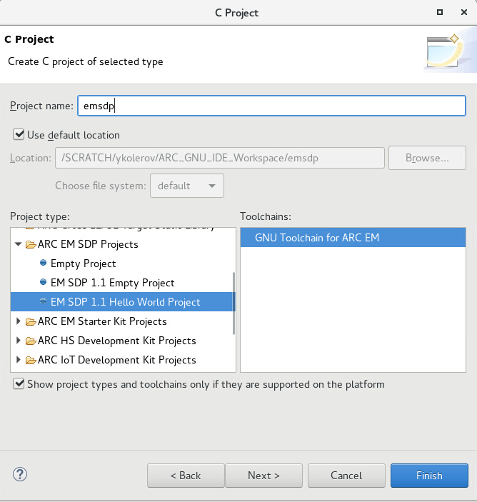
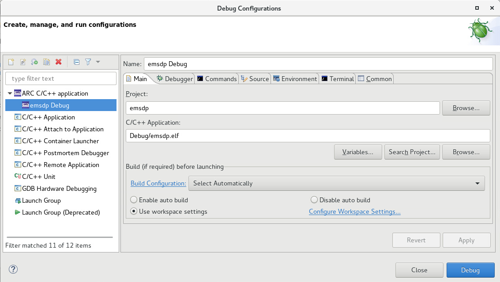
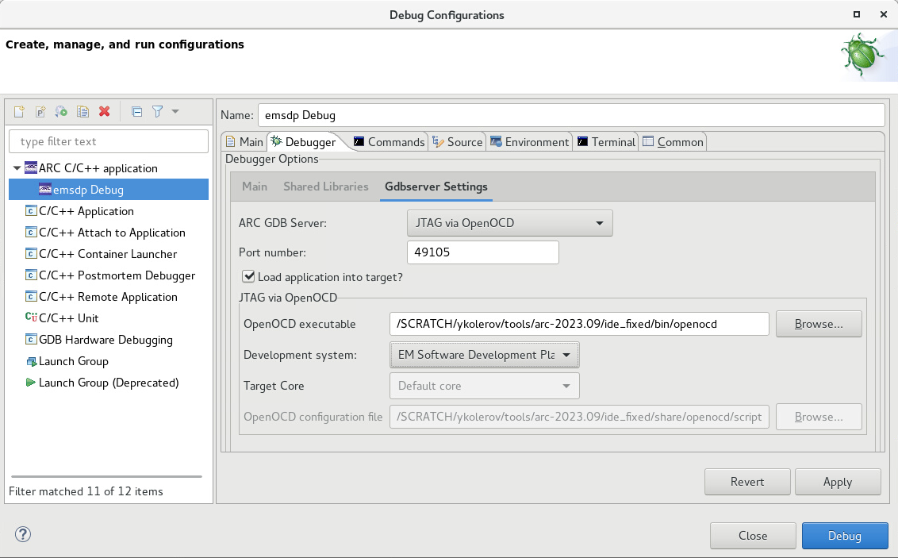
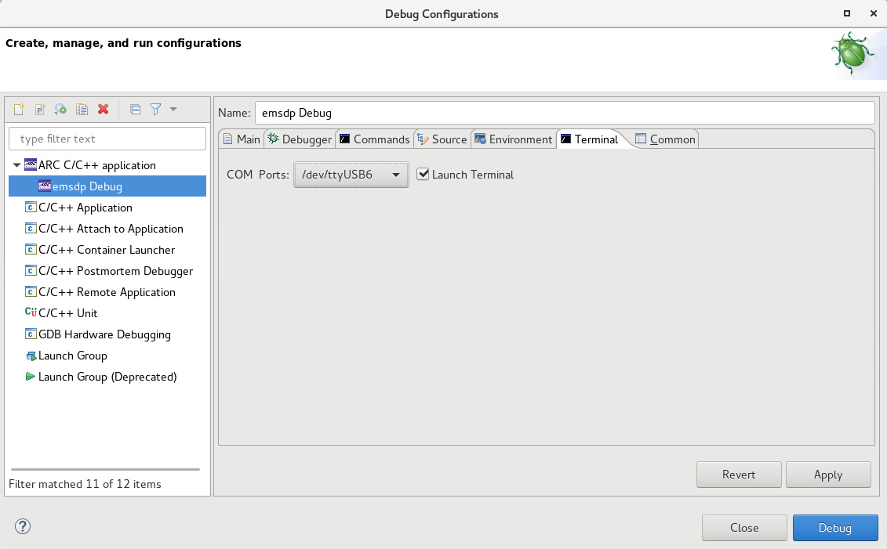
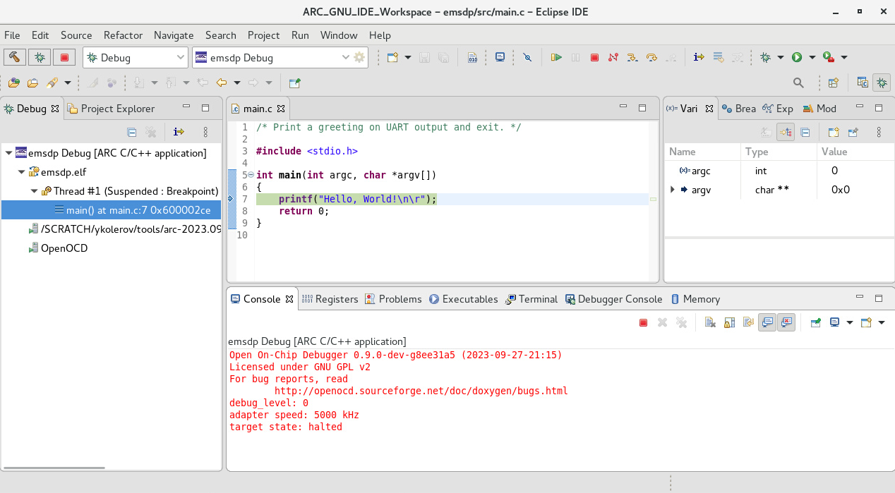
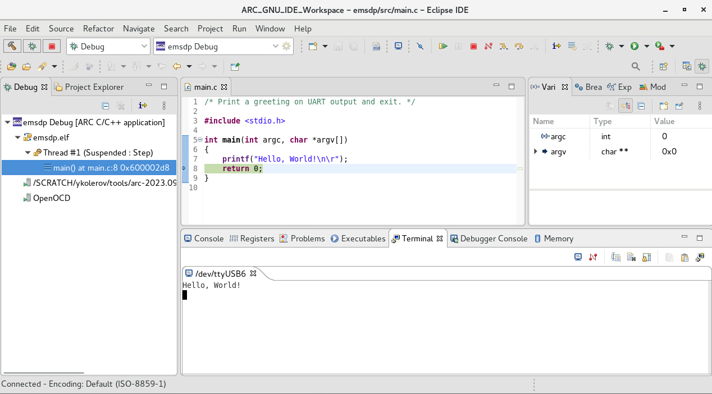

# Getting Started with EM Software Development Platform

!!! info

    Consider reading these guides firstly:

    * [Configuring EM Software Development Platform](../../platforms/board-emsdp.md)
    * [Installing WinUSB driver on Windows](../../platforms/winusb.md)

## Creating the Project

Select **File** → **New** → **Project..** and choose **C Project**.
A list of ARC projects will appear. Choose any ARC EM Starter Kit
"Hello World" project from the **ARC EM SDP Projects** group.



After creating the project, a simple "Hello, World!" program will be created:

```c
/* Print a greeting on UART output and exit. */

#include <stdio.h>

int main(int argc, char *argv[])
{
    printf("Hello, World!\n\r");
    return 0;
}
```

## Building the Project

Do right click on a project in **Project Explorer** ans choose **Build Project**.
The project will be built with this output:

```text
make all 
Building file: ../src/main.c
Invoking: ARC GNU C Compiler
/SCRATCH/ykolerov/tools/arc-2023.09/ide_fixed/bin/arc-elf32-gcc -mcpu=em4_fpuda -mcode-density -mdiv-rem -mswap -mnorm -mmpy-option=6 -mbarrel-shifter -mfpu=fpuda_all --param l1-cache-size=16384 --param l1-cache-line-size=32 -include  /SCRATCH/ykolerov/ARC_GNU_IDE_Workspace/emsdp/Debug/core_config.h -O0 -g3 -Wall -c -fmessage-length=0 -gdwarf-2 -Wa,-adhlns="src/main.o.lst" -MMD -MP -MF"src/main.d" -MT"src/main.o" -o "src/main.o" "../src/main.c"
Finished building: ../src/main.c
 
Building target: emsdp.elf
Invoking: ARC GNU C Linker
/SCRATCH/ykolerov/tools/arc-2023.09/ide_fixed/bin/arc-elf32-gcc -mcpu=em4_fpuda -mcode-density -mdiv-rem -mswap -mnorm -mmpy-option=6 -mbarrel-shifter -mfpu=fpuda_all --param l1-cache-size=16384 --param l1-cache-line-size=32 -specs=emsdp1.1.specs -Wl,-Map,emsdp.map -o "emsdp.elf"  ./src/main.o 
Finished building target: emsdp.elf
```

## Creating a Debug Configuration

Do right click on projects's name in **Project Explorer** and choose
**Debug As** → **Debug Configurations...**. Then do right click on
**ARC C/C++ application** and choose **New Configuration**. Here is a main window of
the debug configuration:



Ensure that a correct project and binary are selected. Navigate to **Main** tab
and **Gdbserver Settings** inner tab:



Choose **JTAG via OpenOCD** as ARC GDB Server and **EM Software Development Platform** as
a development system (use a corresponding one for your case). Then click on **Apply**.

## Configuring a Serial Terminal

Navigate to **Terminal** inner tab of **Main** tab and select a COM port for
the board. Eclipse automatically detects all available COM ports. In my case
it's `/dev/ttyUSB6`.



On Windows you can find the exact number in **Device Manager** (it corresponds
to **USB Serial Port** device):


On Linux a serial device for EM Software Development Platform is usually `/dev/ttyUSB1`
if there are no other serial devices connected to the host.

## Debugging the Project

Open the debug configuration in **Debug Configurations** windows and click
on **Debug** button. The **Debug** perspective will be opened:



Use **Step Over** button to step over `printf` function and select **Terminal**
in the bottom of the window. "Hello world!" string will be printed:


