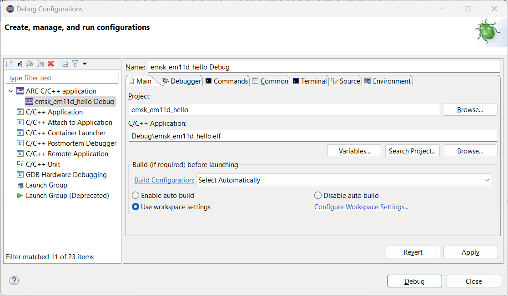
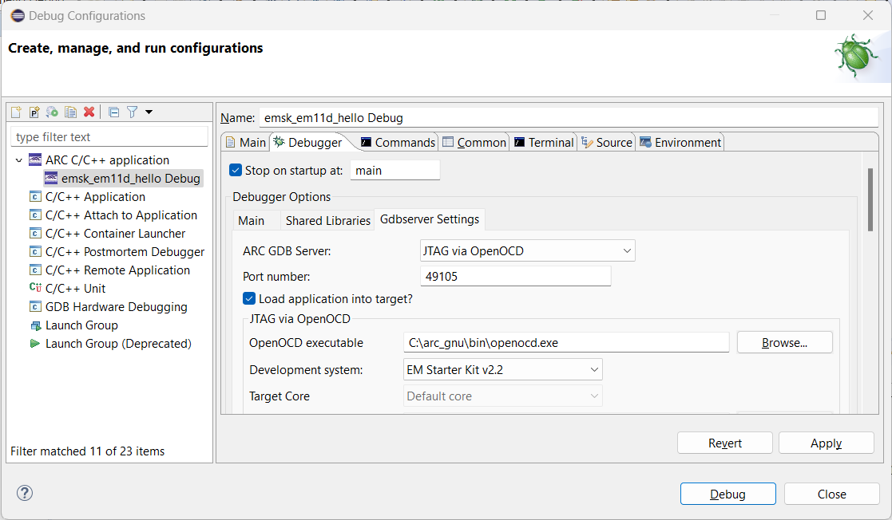
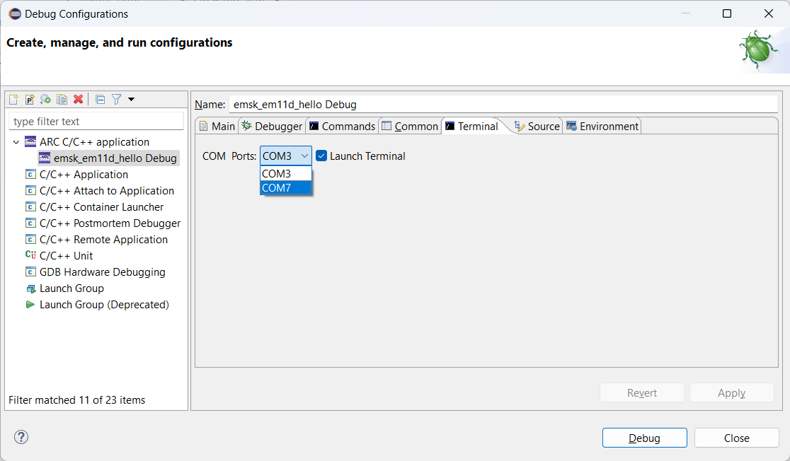
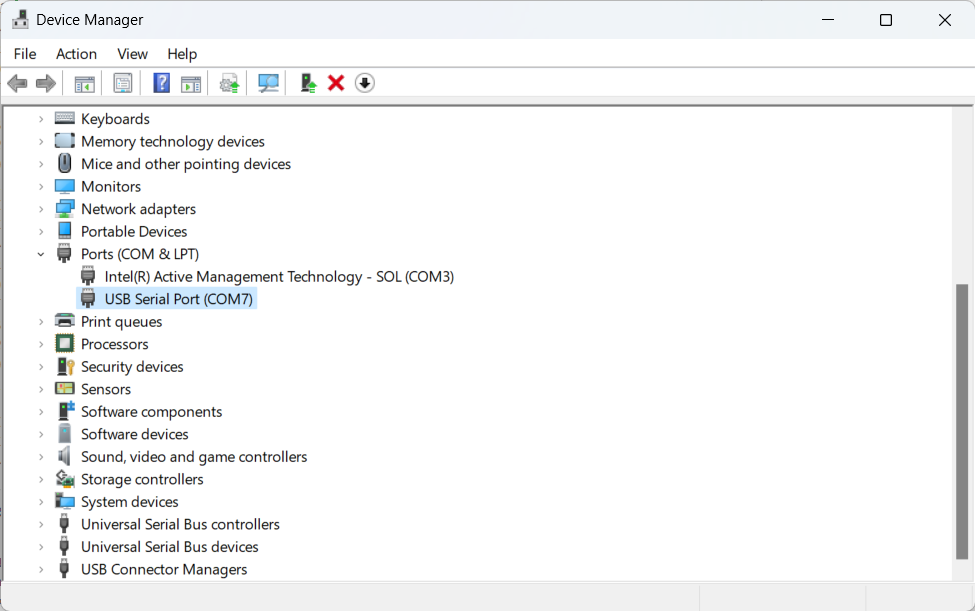
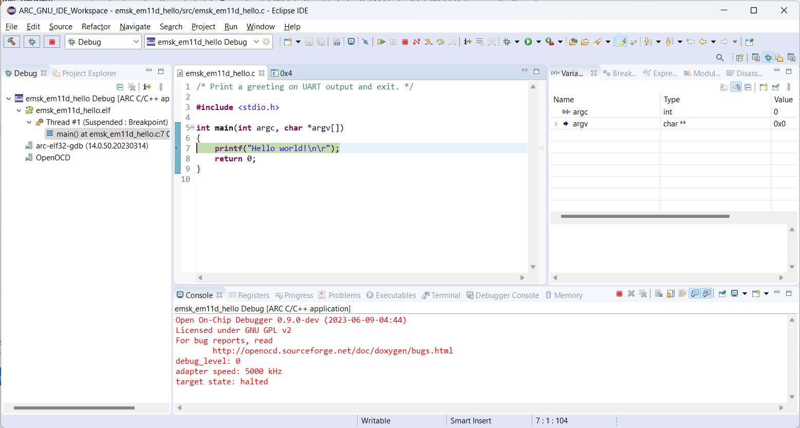
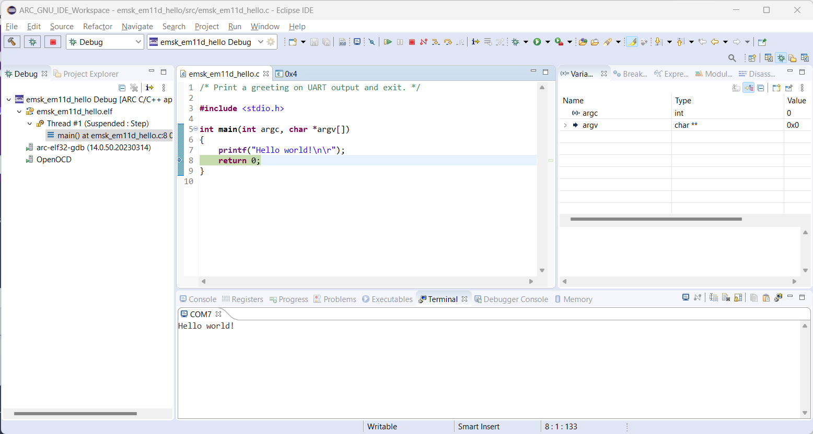

# 🕥 Getting Started with EM Starter Kit

!!! warning

    EM Starter Kit board is no longer supported. There is no guarantee that this guide will
    be applicable for the latest tools.

!!! info

    Consider reading these guides firstly:

    * [Configuring EM Starter Kit](../../platforms/board-emsk.md)
    * [Installing WinUSB driver on Windows](../../platforms/winusb.md)

## Creating the Project

Select **File** → **New** → **Project..** and choose **C Project**.
A list of ARC projects will appear. Choose any ARC EM Starter Kit
"Hello World" project from the **ARC EM Starter Kit Projects** group.
Suppose, EM11D project is chosen.


After creating the project, a simple "Hello, World!" program will be created:

```c
/* Print a greeting on UART output and exit. */

#include <stdio.h>

int main(int argc, char *argv[])
{
    printf("Hello, World!\n\r");
    return 0;
}
```

## Building the Project

Do right click on a project in **Project Explorer** ans choose **Build Project**.
The project will be built with this output:

```text
make all 
'Building file: ../src/emsk_em11d_hello.c'
'Invoking: ARC GNU C Compiler'
C:\arc_gnu\bin\arc-elf32-gcc.exe -mcpu=em4_fpuda -O0 -g3 -Wall -c -fmessage-length=0 -gdwarf-2 -Wa,-adhlns="src/emsk_em11d_hello.o.lst" -MMD -MP -MF"src/emsk_em11d_hello.d" -MT"src/emsk_em11d_hello.o" -o "src/emsk_em11d_hello.o" "../src/emsk_em11d_hello.c"
'Finished building: ../src/emsk_em11d_hello.c'
' '
'Building target: emsk_em11d_hello.elf'
'Invoking: ARC GNU C Linker'
C:\arc_gnu\bin\arc-elf32-gcc.exe -mcpu=em4_fpuda --specs=emsk_em11d.specs -Wl,-Map,emsk_em11d_hello.map -o "emsk_em11d_hello.elf"  ./src/emsk_em11d_hello.o 
'Finished building target: emsk_em11d_hello.elf'
' '
```

## Creating a Debug Configuration

Do right click on projects's name in **Project Explorer** and choose
**Debug As** → **Debug Configurations...**. Then do right click on
**ARC C/C++ application** and choose **New Configuration**. Here is a main window of
the debug configuration:



Ensure that a correct project and binary are selected. Navigate to **Main** tab
and **Gdbserver Settings** inner tab:



Choose **JTAG via OpenOCD** as ARC GDB Server and **EM Starter Kit v2.2** as
a development system (use a corresponding one for your case). Then click on
**Apply**.

## Configuring a Serial Terminal

Navigate to **Terminal** inner tab of **Main** tab and select a COM port for
the board. Eclipse automatically detects all available COM ports. In my case
it's `COM7`.



On Windows you can find the exact number in **Device Manager** (it corresponds
to **USB Serial Port** device):



On Linux a serial device for EM Starter Kit is usually `/dev/ttyUSB1`
if there are no other serial devices connected to the host.

## Debugging the Project

Open the debug configuration in **Debug Configurations** windows and click
on **Debug** button. The **Debug** perspective will be opened:



Use **Step Over** button to step over `printf` function and select **Terminal**
in the bottom of the window. "Hello world!" string will be printed:


