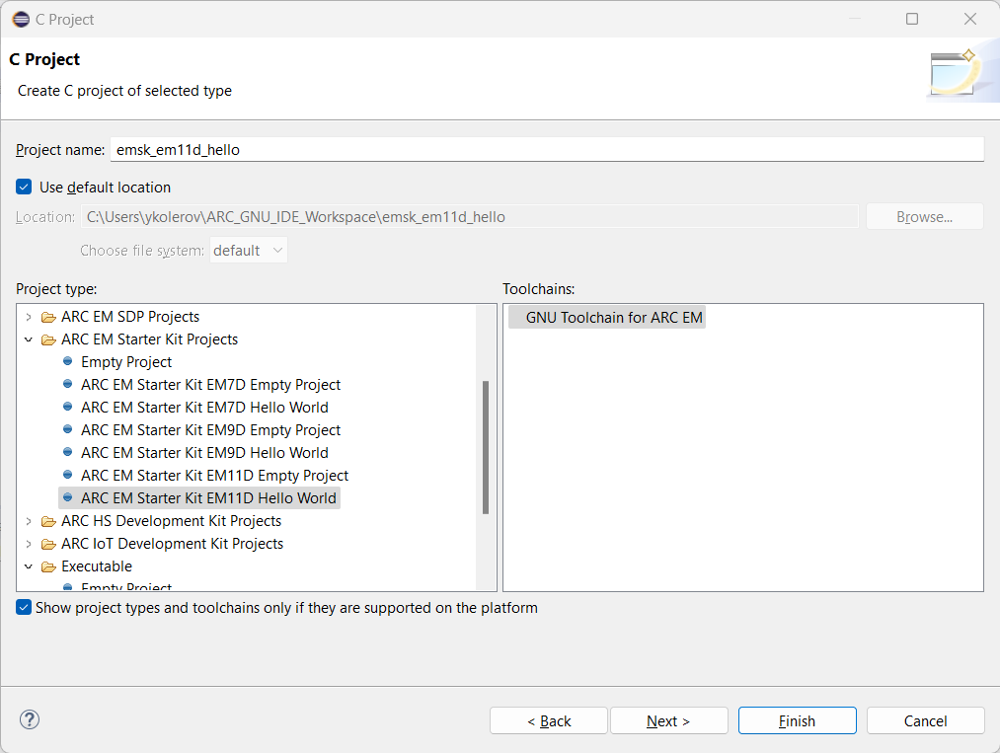

# Getting Started with EM Starter Kit

!!! info

    Consider reading these guides firstly:

    * [Configuring EM Starter Kit](https://github.com/foss-for-synopsys-dwc-arc-processors/ARC-Development-Systems-Forum/wiki/ARC-Development-Systems-Forum-Wiki-Home#arc-em-starter-kit-1)
    * [Installing WinUSB driver on Windows](../../platforms/winusb.md)

## Creating the Project

Select **File** → **New** → **Project..** and choose **C Project**.
A list of ARC projects will appear. Choose any ARC EM Starter Kit
"Hello World" project from the **ARC EM Starter Kit Projects" group.
Suppose, EM11D project is chosen.

{ width="700" }

After creating the project, a simple "Hello, World!" program will be created:

```c
#include <stdio.h>

int main(int argc, char *argv[])
{
    printf("Hello world!\n\r");
    return 0;
}
```

## Building the Project

Do right click on a project in **Project Explorer** ans choose **Build Project**.
The project will be built with this output:

```text
make all 
'Building file: ../src/emsk_em11d_hello.c'
'Invoking: ARC GNU C Compiler'
C:\arc_gnu\bin\arc-elf32-gcc.exe -mcpu=em4_fpuda -O0 -g3 -Wall -c -fmessage-length=0 -gdwarf-2 -Wa,-adhlns="src/emsk_em11d_hello.o.lst" -MMD -MP -MF"src/emsk_em11d_hello.d" -MT"src/emsk_em11d_hello.o" -o "src/emsk_em11d_hello.o" "../src/emsk_em11d_hello.c"
'Finished building: ../src/emsk_em11d_hello.c'
' '
'Building target: emsk_em11d_hello.elf'
'Invoking: ARC GNU C Linker'
C:\arc_gnu\bin\arc-elf32-gcc.exe -mcpu=em4_fpuda --specs=emsk_em11d.specs -Wl,-Map,emsk_em11d_hello.map -o "emsk_em11d_hello.elf"  ./src/emsk_em11d_hello.o 
'Finished building target: emsk_em11d_hello.elf'
' '
```

## Creating a Debug Configuration

## Configuring a Serial Terminal

## Debugging the Project

