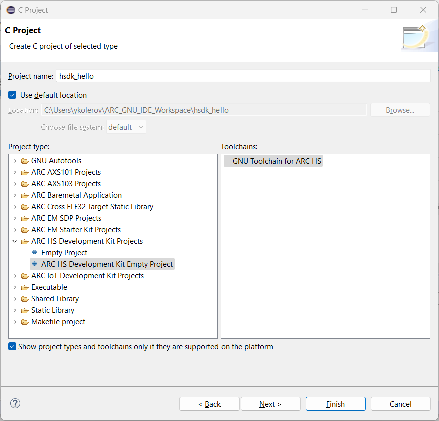
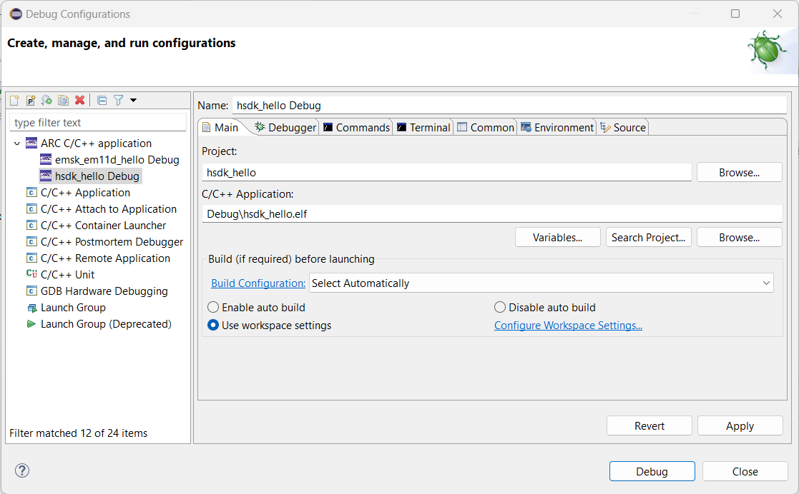
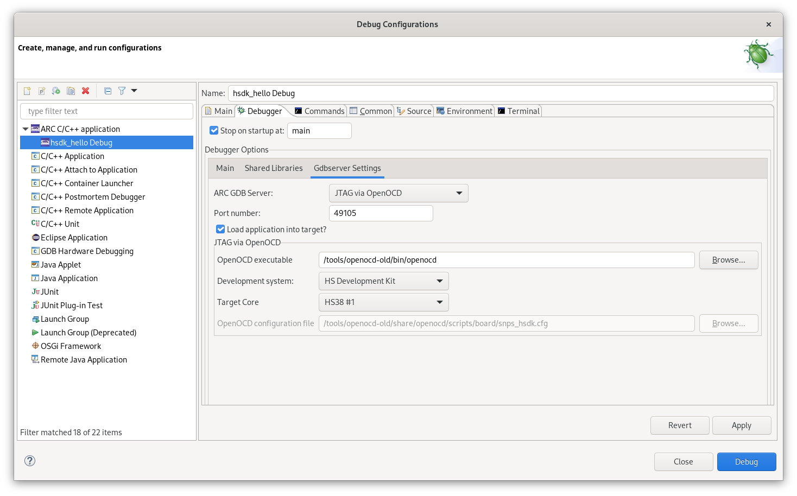
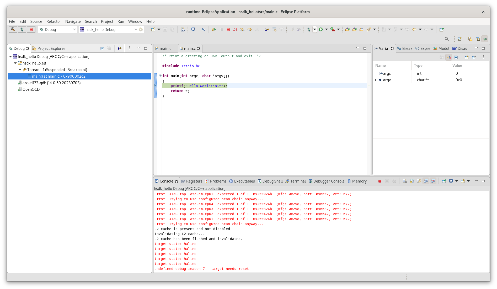

# Getting Started with HS Development Kit

!!! info

    Consider reading these guides firstly:

    * [Configuring HS Development Kit](https://github.com/foss-for-synopsys-dwc-arc-processors/ARC-Development-Systems-Forum/wiki/ARC-Development-Systems-Forum-Wiki-Home#arc-hs-development-kit-1)
    * [Configuring HS Development Kit 4xD](https://github.com/foss-for-synopsys-dwc-arc-processors/ARC-Development-Systems-Forum/wiki/ARC-Development-Systems-Forum-Wiki-Home#arc-hs4xhs4xd-development-kit-1)
    * [Installing WinUSB driver on Windows](../../platforms/winusb.md)

## Creating the Project

Select **File** → **New** → **Project..** and choose **C Project**.
A list of ARC projects will appear. Choose any **ARC HS Development Kit Empty Project**
from the **ARC EM Starter Kit Projects** group:



An empty project will be created. Add a new C source file with name `main.c`
in `src` directory in **Project Explorer**:

```c
int main(int argc, char *argv[])
{
    return 0;
}
```

## Building the Project

Do right click on a project in **Project Explorer** ans choose **Build Project**.
The project will be built with this output:

```text
make all 
'Building file: ../src/main.c'
'Invoking: ARC GNU C Compiler'
C:\arc_gnu\bin\arc-elf32-gcc.exe -mcpu=hs38_linux -matomic -mll64 -mdiv-rem -mswap -mnorm -mmpy-option=9 -mbarrel-shifter -mfpu=fpud_all --param l1-cache-size=65536 --param l1-cache-line-size=64 -include  C:\Users\ykolerov\ARC_GNU_IDE_Workspace\hsdk_hello\Debug\core_config.h -O0 -g3 -Wall -c -fmessage-length=0 -gdwarf-2 -Wa,-adhlns="src/main.o.lst" -MMD -MP -MF"src/main.d" -MT"src/main.o" -o "src/main.o" "../src/main.c"
'Finished building: ../src/main.c'
' '
'Building target: hsdk_hello.elf'
'Invoking: ARC GNU C Linker'
C:\arc_gnu\bin\arc-elf32-gcc.exe -mcpu=hs38_linux -matomic -mll64 -mdiv-rem -mswap -mnorm -mmpy-option=9 -mbarrel-shifter -mfpu=fpud_all --param l1-cache-size=65536 --param l1-cache-line-size=64 -Wl,-marcv2elfx -L  C:\Users\ykolerov\ARC_GNU_IDE_Workspace\hsdk_hello\Debug --specs=nosys.specs -Wl,--defsym=ivtbase_addr=0x0 -Wl,-Map,hsdk_hello.map -o "hsdk_hello.elf"  ./src/main.o 
'Finished building target: hsdk_hello.elf'
' '
```

## Creating a Debug Configuration

Do right click on projects's name in **Project Explorer** and choose
**Debug As** → **Debug Configurations...**. Then do right click on
**ARC C/C++ application** and choose **New Configuration**. Here is a main window of
the debug configuration:



Ensure that a correct project and binary are selected. Navigate to **Main** tab
and **Gdbserver Settings** inner tab:



Choose **JTAG via OpenOCD** as ARC GDB Server and **HS Development Kit** as
a development system (use a corresponding one for your case). Also,
choose **HS38 #1** target core. Then click on **Apply**.

## Configuring a Serial Terminal

Input/output functions for HS Development Kit are not supported by the toolchain yet.
Navigate to **Terminal** inner tab of **Main** tab and unselect **Launch Terminal**
checkbox.

## Debugging the Project

Open the debug configuration in **Debug Configurations** windows and click
on **Debug** button. The **Debug** perspective will be opened:


