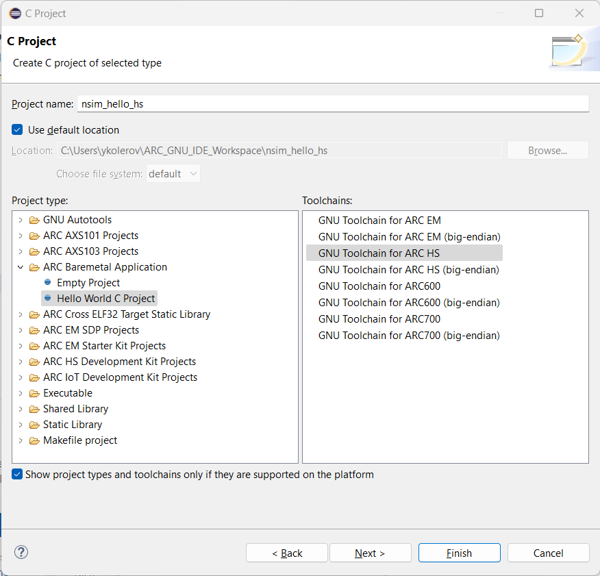
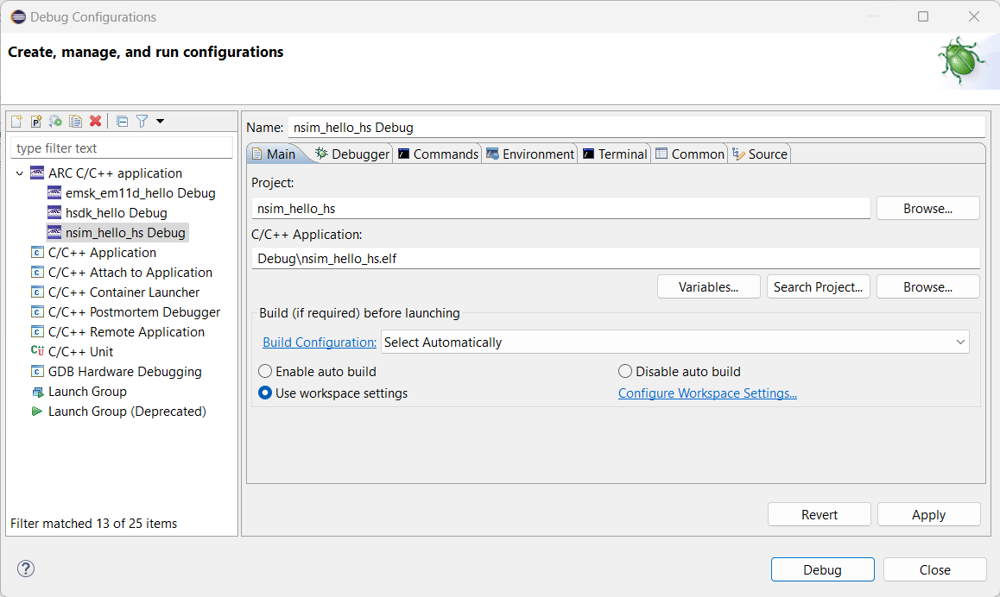
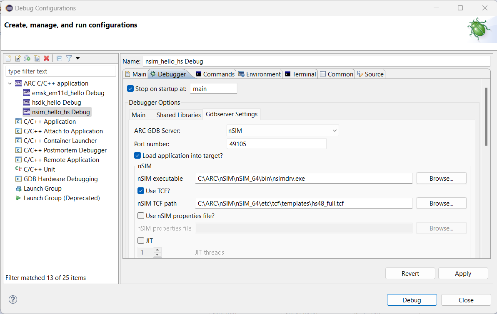
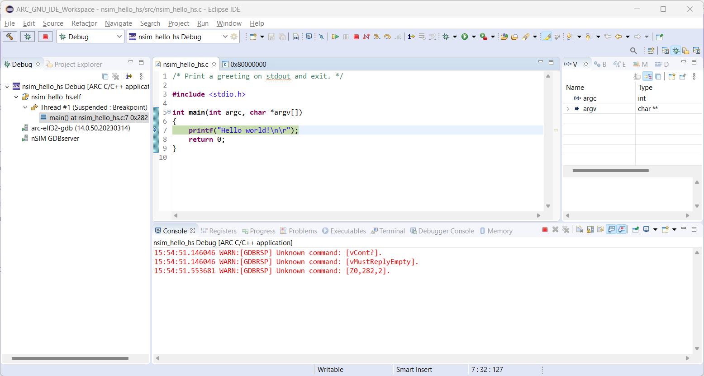
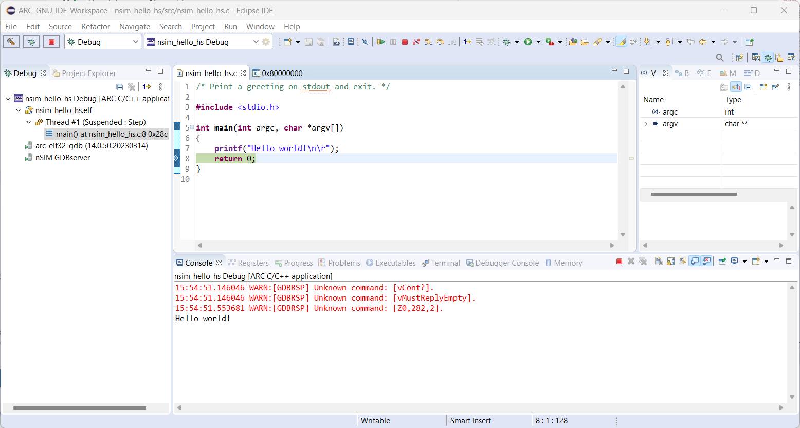

# Getting Started with nSIM

!!! warning

    Eclipse IDE for ARCompact targets does not support selecting a value for `-specs=` option in project's configuration menu.
    By default, it's not passed to the linker and input/output capabilities are not available. Consider passing `-specs=nsim.specs`
    through **ARC GNU Linker** field of project's configuration dialog (**C/C++ Build** -> **Settings** -> **Top Settings** -> **ARC GNU Linker**).

## Prerequisites

You should have nSIM installed on your computer. You also might need to set
environment variable `LM_LICENSE_FILE=<your_license>` in case if you have
full nSIM version. Otherwise you will get licensing failure.

## Creating the Project

Select **File** → **New** → **Project..** and choose **C Project**.
A list of ARC projects will appear. Choose **Hello World C Project**
from the **ARC Baremetal Application** group. Also, choose
**GNU Toolchain for ARC HS** toolchain.



After creating the project, a simple "Hello, World!" program will be created:

```c
/* Print a greeting on UART output and exit. */

#include <stdio.h>

int main(int argc, char *argv[])
{
    printf("Hello, World!\n\r");
    return 0;
}
```

## Building the Project

Do right click on a project in **Project Explorer** ans choose **Build Project**.
The project will be built with this output:

```text
make all 
'Building file: ../src/nsim_hello_hs.c'
'Invoking: ARC GNU C Compiler'
C:\arc_gnu\bin\arc-elf32-gcc.exe -mcpu=hs -O0 -g3 -Wall -c -fmessage-length=0 -gdwarf-2 -Wa,-adhlns="src/nsim_hello_hs.o.lst" -MMD -MP -MF"src/nsim_hello_hs.d" -MT"src/nsim_hello_hs.o" -o "src/nsim_hello_hs.o" "../src/nsim_hello_hs.c"
'Finished building: ../src/nsim_hello_hs.c'
' '
'Building target: nsim_hello_hs.elf'
'Invoking: ARC GNU C Linker'
C:\arc_gnu\bin\arc-elf32-gcc.exe -mcpu=hs --specs=nsim.specs -Wl,-Map,nsim_hello_hs.map -o "nsim_hello_hs.elf"  ./src/nsim_hello_hs.o 
'Finished building target: nsim_hello_hs.elf'
' '
'Invoking: ARC GNU Print Size'
C:\arc_gnu\bin\arc-elf32-size.exe  --format=berkeley nsim_hello_hs.elf
   text	   data	    bss	    dec	    hex	filename
  41088	   1724	    792	  43604	   aa54	nsim_hello_hs.elf
'Finished building: nsim_hello_hs.siz'
' '
```

## Creating a Debug Configuration

Do right click on projects's name in **Project Explorer** and choose
**Debug As** → **Debug Configurations...**. Then do right click on
**ARC C/C++ application** and choose **New Configuration**. Here is a main window of
the debug configuration:



Ensure that a correct project and binary are selected. Navigate to **Main** tab
and **Gdbserver Settings** inner tab:



Choose **nSIM** as ARC GDB Server. Unselect **Use nSIM properties file?**
and select **hs48_full.tcf** TCF file from nSIM installation.

Navigate to **Terminal** inner tab of **Main** tab and unselect **Launch Terminal**
checkbox.

## Debugging the Project

Open the debug configuration in **Debug Configurations** windows and click
on **Debug** button. The **Debug** perspective will be opened:



Use **Step Over** button to step over `printf` function. You can observe
output in **Console** tab:



## Using Big Endian Configuration

If you use the big endian toolchain and want to debug the application using
nSIM then you need to create a corresponding TCF file manually since there are
no TCF files for big endian targets.

For example, if you want to use `hs48_full.tcf` TCF file then duplicate it
with name `hs48_full_big.tcf`, find this string in it:

```text
nsim_isa_big_endian=0
```

and change it to this line:

```text
nsim_isa_big_endian=1
```

Now you can use this TCF file for running big endian applications on nSIM.
