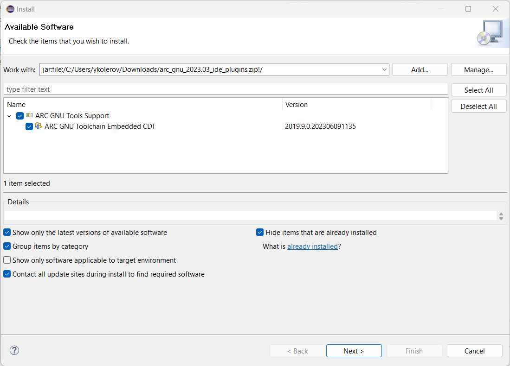
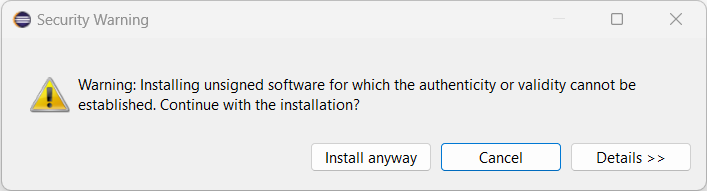

# Manual Installation

## Installing Eclipse

Download Eclipse IDE for C/C++ Developers 2020.03 from the
official [download page](https://www.eclipse.org/downloads/packages/release/2020-03/r/eclipse-ide-cc-developers-includes-incubating-components). Extract it to
`eclipse` directory.

## Install Java SE 11 Runtime

Download Java SE 11 runtime from the official [Java download page](https://www.oracle.com/java/technologies/javase/jdk11-archive-downloads.html). Suppose, that the archive contains `jdk-11.0.19`
directory, then extract it to `eclipse` directory and rename to `jre`.

## Downloading the Plugin

User can get the latest plugin from [the release page](https://github.com/foss-for-synopsys-dwc-arc-processors/toolchain/releases/).
For example, filename of the archive with the plugin for 2023.03 release
is `arc_gnu_2023.03_ide_plugins.zip`.

Here is an example of plugin's directory contents:

```text
$ tree
.
├── artifacts.jar
├── content.jar
├── features
│   └── com.arc.cdt.feature_2019.9.0.202306091135.jar
└── plugins
    ├── com.arc.embeddedcdt_2019.9.0.202306091135.jar
    └── com.synopsys.arc.gnu.elf_2019.9.0.202306091135.jar

3 directories, 5 files
```

## Installing the Plugin

### Installing "TM Terminal"

Install "TM Terminal" plugin through "Help" -> "Install New Software..." menu.
Choose "--All Available Sites--" in "Work with" field. Wait until a list of
available plugins is updated and select "General Purpose Tools" -> "TM Terminal"
plugin. Press "Next" button and proceed with the installation process.

### Installing ARC GNU Plugin

Open "Help" -> "Install New Software..." -> Add -> Archive menu and
and select the downloaded plugin's archive (e.g., `arc_gnu_2023.03_ide_plugins.zip`).
Then choose "ARC GNU Tools Support", press "Next" button and proceed with
the installation process:

{ width="700" }

Press "Install anyway" when "Security Warning" is shown:

{ width="700" }

You can find information about the installed plugins in
"Help" -> "About Eclipse IDE" -> "Installation Details" window.

## Updating the Existing Plugin

To update the existing plugin follow [Installing Eclipse](#installing-eclipse)
guide but for the newer plugin version.
