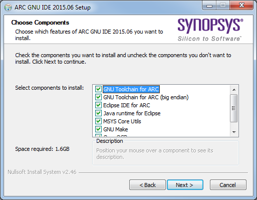

# Installing Eclipse IDE on Windows

## Using the Installer for Windows

Windows users are advised to use our Windows installer for Eclipse for GNU Toolchain for IDE,
that can be downloaded from this [releases page](https://github.com/foss-for-synopsys-dwc-arc-processors/toolchain/releases).
Installer already contains all of the necessary components. ARC GNU IDE should be installed in the path no longer
than 50 characters and cannot contain white spaces.

After downloading the installer, accept a license agreement and follow other steps.
By default, Eclipse IDE is installed in `C:\arc_gnu` directory. Eclipse IDE
executable is `C:\arc_gnu\eclipse\eclipse.exe`.

## Installing a Big Endian Toolchain

By default, Eclipse IDE installer does not choose a big endian toolchain
for installing. Select this toolchain manually on "Choose Components" stage:

