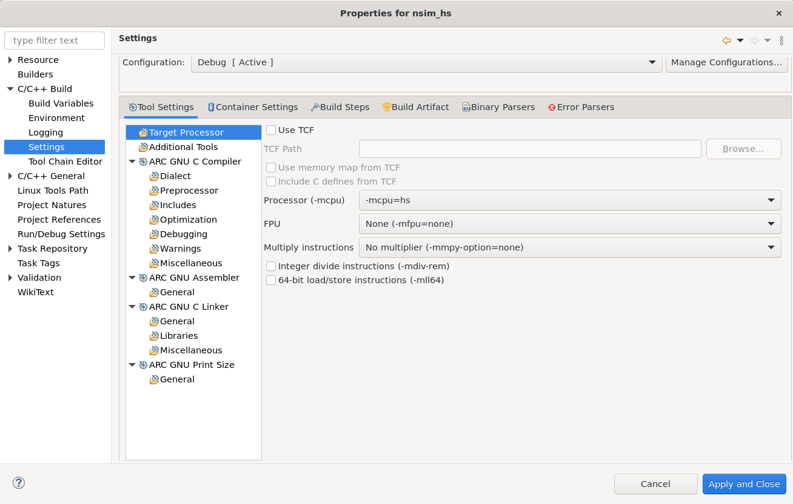
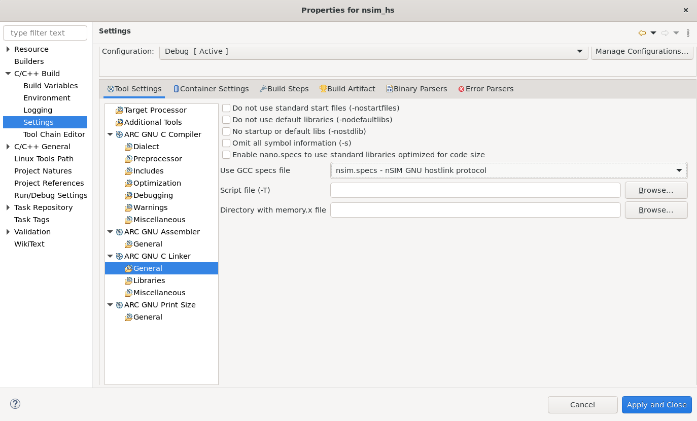

# Project Build Settings

To the project's build settings do right click on the project in
**Project Explorer** and choose **Properties**. Build settings may be found
in **C/C++ Build** → **Settings** menu.

## Target Processor

**Target Processor** page allows to configure target specific options:

* **Processor (-mcpu)** selects a preset of target options. Refer
  [Target Options](../../toolchain/index.md) sections for
  information about all `-mcpu=...` values. Note that some `-mcpu=...` values
  may disable selectors for other options since they activate predefined
  values for target options.
* **FPU** configures Floating Point Unit instructions. Refer
  [Target Options](../../toolchain/index.md) sections for
  information about all `-mfpu=...` values.
* **Multiply instructions** configures multiplication instructions. Refer
  [Target Options](../../toolchain/index.md) sections for information
  about all `-mmpy-option=...` values.
* **Use TCF** checkbox enables using a TCF file for configuring the compiler.
  The TCF file contains predefined GCC options. If **Use memory map from TCF**
  is selected then the linker will use a memory map from the TCF file. If
  **Include C defines from TCF** is selected then all C defines from the TCF
  file will be implicitly included in the project and available in all C files.

    Note that if you use TCF to provide target options, there are no checks that
    option values are consistent with CPU and you can specify there values that
    are weaker than CPU value requires. So please be careful when editing TCFs.

Refer [Target Options](../../toolchain/index.md) sections for
information about other target specific options available on **Target Processor**
page.

## Linker Options

Options for the linker may be found on **ARC GNU C Linker** → **General** page.
Here is a list of the most important options:

* **Enable nano.specs ...** enables using nano version of Newlib standard
  library. Refer [Specs Files](../../baremetal/general/specs.md) for further
  information.
* **Use GCC specs file** select a specs file for a particular platform.
  Refer [Specs Files](../../baremetal/general/specs.md) for further
  information about specs files.

