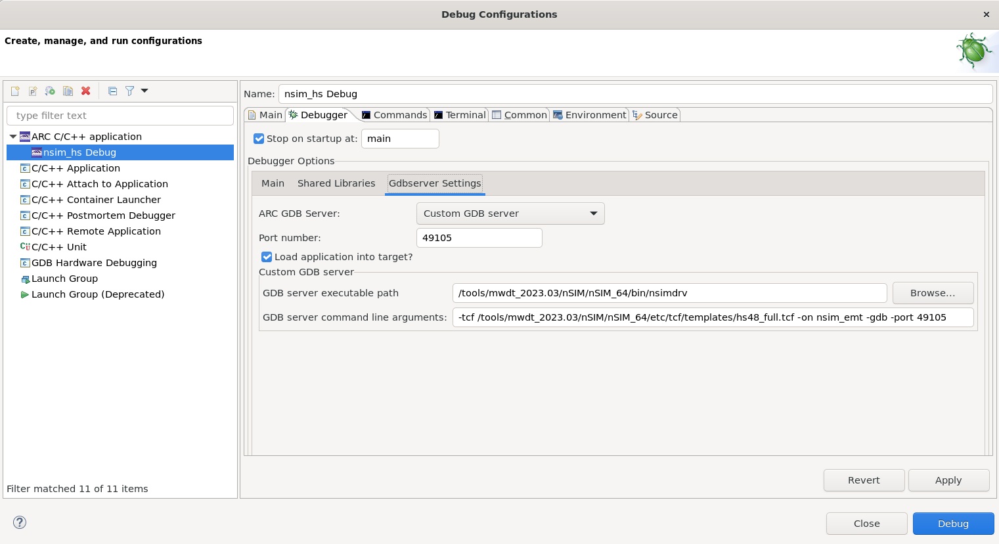

# Using a Custom GDB Server

It's possible to create a debug configuration with a custom GDB server.
Consider a couple of examples on this page.

## Custom nSIM GDB Server

Follow [Creating a Debug Configuration](../getting-started/nsim.md) guide and
create a simple "Hello, World!" project for running using nSIM.
Then do right click on projects's name in **Project Explorer** and choose
**Debug As** → **Debug Configurations...**. Then do right click on
**ARC C/C++ application** and choose **New Configuration**. Select
**Gdbserver Settings** tab and choose **Custom GDB server** option.

There are two fields available:

* **GDB server executable path** stands for a path to GDB server executable.
  It's a path to `nsimdrv` (`nsimdrv.exe` in Windows) executable for this example.
* **GDB server command line arguments** stands for a set of command line arguments
  for `nsimdrv`. For example:

    ```text
    -tcf /tools/mwdt_2023.03/nSIM/nSIM_64/etc/tcf/templates/hs48_full.tcf -on nsim_emt -gdb -port 49105
    ```

    `-tcf` sets a TCF file, `-on nsim_emt` enables input/output interface and
    `-gdb -port 49105` tells nSIM to start a GDB server on 49105 port.



## Custom OpenOCD GDB Server

A custom OpenOCD GDB server may be created the same way. Follow
[Getting OpenOCD](../../platforms/get-openocd.md) and
[Using OpenOCD](../../platforms/use-openocd.md) guides to find out how to
get and run OpenOCD.

For example, if the full path of OpenOCD binary is `/home/user/tools/openocd/bin/openocd`,
then here is command line arguments field value for EM Starter Kit 2.3:

```text
-c "gdb_port 49105" -s /home/user/tools/share/openocd/scripts -f board/snps_em_sk_v2.3.cfg
```
