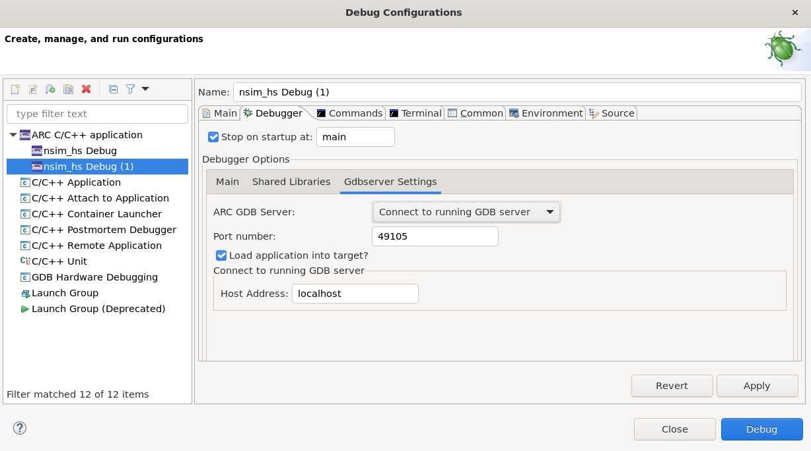

# Using a Running GDB Server

It's possible to create a debug configuration for connecting to a running
GDB server. It means that the GDB server must be run manually before starting
the GDB session.

## Connecting to nSIM GDB Server

Follow [Creating a Debug Configuration](../getting-started/nsim.md) guide and
create a simple "Hello, World!" project for running using nSIM.
Then do right click on projects's name in **Project Explorer** and choose
**Debug As** → **Debug Configurations...**. Then do right click on
**ARC C/C++ application** and choose **New Configuration**. Select
**Gdbserver Settings** tab and choose **Connect to running GDB server** option.

Then you can type **Host Address** for the server. If the server is running
on the same machine then use a default `localhost` value.



Consider that the project is built successfully. Then you can start
nSIM GDB server this way in a terminal:

```shell
nsimdrv -tcf $NSIM_HOME/etc/tcf/templates/hs48_full.tcf -on nsim_emt -gdb -port 49105
```

Then you can start debugging as usual.

## Connecting to OpenOCD GDB Server

Follow [Getting OpenOCD](../../platforms/get-openocd.md) and
[Using OpenOCD](../../platforms/use-openocd.md) guides to find out how to
get and run OpenOCD.

For example, if the full path of OpenOCD binary is `/home/user/tools/openocd/bin/openocd`,
then here is command line arguments field value for EM Starter Kit 2.3:

```shell
/home/user/tools/openocd/bin/openocd \
    -c "gdb_port 49105" \
    -s /home/user/tools/share/openocd/scripts \
    -f board/snps_em_sk_v2.3.cfg
```
