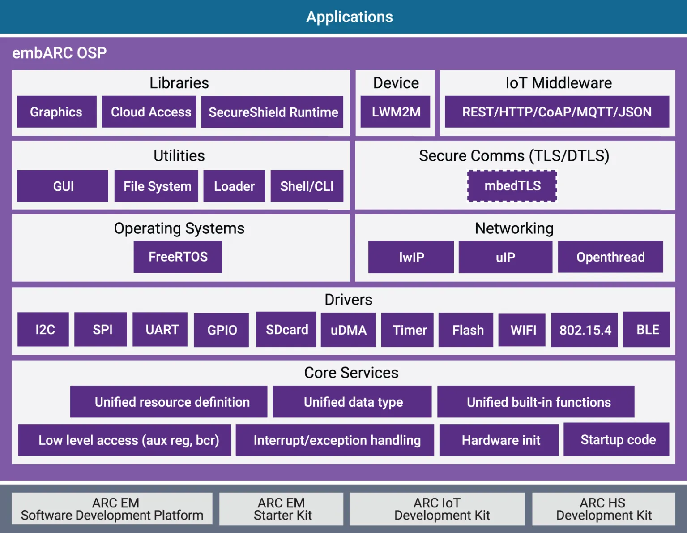

# embARC Open Software Platform (OSP)

## Overview

The embARC Open Software Platform (OSP) is an open source software distribution
for embedded applications on ARC® Processors. The embARC OSP distribution is
managed by Synopsys for the community and all contributions are welcomed
(requires CLA).

It is designed to provide a unified platform for DesignWare® ARC® processors
users by defining consistent and simple software interfaces to the processor
and peripherals, together with ports of several well known FOSS embedded
software stacks to DesignWare® ARC® processors.

embARC OSP provides a starting foundation for embedded developers, simplifying
development and improving time-to-market through software reuse.

## Purpose and Scope

embARC OSP is an open software platform, providing useful components with a
consistent software layering model and interfaces to DesignWare® ARC®
processors for portability and reusability. Developers can write software
based on embARC OSP to accelerate implementation and reduce their learning
curve and the time-to-market of final product implementation.

The goals of embARC are as follows:

* Provide an easy introduction for new users of DesignWare® ARC® processors.
* Provide useful software stacks as a starting point for building embedded
  products based on DesignWare® ARC® processors and well-known open-source
  software packages.
* Provide broad ranges of examples to demonstrate DesignWare® ARC® processors
  usage in various embedded IoT applications.
* Provide simple, frictionless out-of-the box user experience through:
* Single archive download containing all embARC packages and examples.
* Comprehensive pre-integrated tools support.
* Clear, simple, and extensive how-to instructions.

## Architecture

The embARC Open Software Platform general architecture and components are
shown in the block diagram below.

## Resources

* [Source Repository](https://github.com/foss-for-synopsys-dwc-arc-processors/embarc_osp)
* [Releases Page](https://github.com/foss-for-synopsys-dwc-arc-processors/embarc_osp/releases)
* [Documentation](https://foss-for-synopsys-dwc-arc-processors.github.io/embarc_osp/doc/build/html/index.html)
* [Support](https://github.com/foss-for-synopsys-dwc-arc-processors/embarc_osp/issues)
