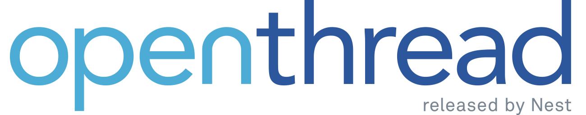
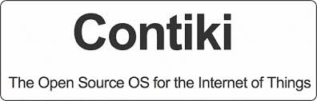

# IoT Platform and RTOS Projects for ARC Processors

## embARC Open Software Platform (OSP)

The embARC Open Software Platform (OSP) is an open source software distribution
for embedded applications on ARC® Processors. The embARC OSP distribution is
managed by Synopsys for the community and all contributions are welcomed
(requires CLA).

Refer [the corresponding page](embarc-osp.md) for details.

## embARC Board Support Package (BSP)

The embARC Board support Package (BSP) for DesignWare® ARC® EM Starter Kit
(EMSK) is a software distribution aimed at facilitating the development and
evaluation of embedded systems based on ARCv2 processors. It is designed to
provide a minimal board support package for ARC EMSK users by defining
consistent and simple software interfaces to the processors and onboard
devices.

Refer [the corresponding page](embarc-bsp.md) for details.

## Zephyr Project

The Zephyr™ Project, is a Linux Foundation hosted Collaboration Project, an
open source collaborative effort uniting leaders from across the industry to
build a best-in-breed small, scalable, real-time operating system (RTOS)
optimized for resource constrained devices, across multiple architectures.

* [Source Repository](https://github.com/zephyrproject-rtos/zephyr)
* [Releases Page](https://github.com/zephyrproject-rtos/zephyr/releases)
* [Documentation](https://docs.zephyrproject.org/latest/index.html)
* [Mailing List](https://lists.zephyrproject.org/mailman/listinfo)

## OpenThread

OpenThread is a Thread Certified Component an open-source implementation of
the Thread networking protocol. Nest has released OpenThread to make the
technology used in Nest products more broadly available to developers to
accelerate the development of products for the connected home.

* [Source Repository](https://github.com/openthread/openthread)
* [Releases Page](https://github.com/openthread/openthread/releases)
* [Documentation](https://openthread.io)
* [Support](https://github.com/openthread/openthread/discussions)

## FreeRTOS

Developed in partnership with the world's leading chip companies over a 12
year period, FreeRTOS is the market leading real time operating system
(or RTOS), and the de-facto standard solution for microcontrollers and small
microprocessors. Support for FreeRTOS on ARC Processors is provided under
the embARC OSP project.

Refer [the corresponding page](embarc-osp.md) for details.

## NuttX

NuttX is a small footprint real-time operating system that implements POSIX and
ANSI standards supplemented by APIs adapted from other common RTOSes. NuttX is
sponsored by the Apache Software Foundation.

* [Source Repository](https://github.com/foss-for-synopsys-dwc-arc-processors/nuttx)
* [Documentation](https://nuttx.apache.org/docs/latest/)
* [Support](https://github.com/foss-for-synopsys-dwc-arc-processors/nuttx/issues)

## TencentOS tiny

TencentOS tiny is a real-time operating system for the Internet of Things.
It features low power consumption, low resource consumption, modularity,
security and reliability, and can effectively improve the development
efficiency of IoT terminal products. The TencentOS tiny project is sponsored
by Tencent.

* [Source Repository](https://github.com/OpenAtomFoundation/TencentOS-tiny)
* [Documentation](https://cloud.tencent.com/product/tos-tiny)
* [Support](https://github.com/OpenAtomFoundation/TencentOS-tiny/issues)

## LiteOS kernel

Huawei LiteOS is an IoT-oriented software platform that integrates an IoT
operating system and middleware. It is lightweight, with a kernel as small
as 10 KB, and energy efficient.

* [Source Repository](https://github.com/foss-for-synopsys-dwc-arc-processors/LiteOS_Kernel)
* [Documentation](https://github.com/foss-for-synopsys-dwc-arc-processors/LiteOS_Kernel/blob/master/README.md)
* [Support](https://github.com/LiteOS/LiteOS/issues)

## Contiki OS

Contiki is an open source operating system for the Internet of Things. Contiki
connects tiny low-cost, low-power microcontrollers to the Internet. Support for
Contiki OS on ARC Processors is provided under the embARC OSP project.

Refer [the corresponding page](embarc-osp.md) for details.

## RiOT OS

RIOT is a free, open source operating system developed by a grassroots
community gathering companies, academia, and hobbyists, distributed all around
the world. RIOT implements all relevant open standards supporting an Internet
of Things that is connected, secure, durable, and privacy-friendly. A port to
the ARC EM Processor has been contributed by the community.

* [Source Repository](https://github.com/foss-for-synopsys-dwc-arc-processors/RIOT)
* [Documentation](https://doc.riot-os.org)
* [Support](https://www.riot-os.org/community.html)

## Toppers ASP

TOPPERS（Toyohashi OPen Platform for Embedded Real-time Systems）Project,
based on ITRON, is aimed at base software for use in embedded systems. The
TOPPERS/ASP kernel is the foundation for the new generation of TOPPERS
real-time kernels that follow the TOPPERS new generation kernel specification.
ASP (Advanced Standard Profile) has been developed by extending and improving
TOPPERS/JSP, a real-time kernel based on the standard profile of μITRON4.0.
Support for the ARC architecture is available below.

* [Source Repository](https://github.com/foss-for-synopsys-dwc-arc-processors/toppers-asp)
* [Documentation](https://www.toppers.jp/en/asp-kernel.html)
* [Support](https://www.toppers.jp/en/community.html)
