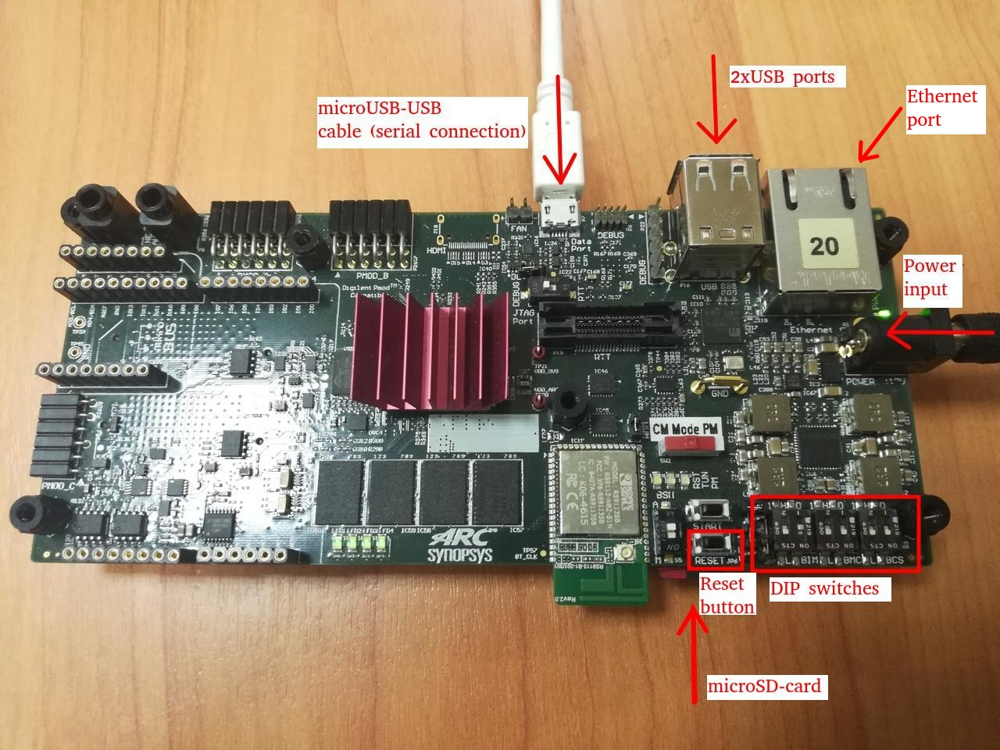

# Building and Running ARC Linux for HS Development Kit

## Preparing the Board

The ARC HSDK development system is based on a custom designed Synopsys ARC SoC containing the ARC HS38x4 (quad core) processor. Please refer to board's documentation for detailed information about how to setup the board for initial operation:

* [ARC HS Development Kit](https://github.com/foss-for-synopsys-dwc-arc-processors/ARC-Development-Systems-Forum/wiki/ARC-Development-Systems-Forum-Wiki-Home#arc-hs-development-kit-1)
* [ARC HS4x/HS4xD Development Kit](https://github.com/foss-for-synopsys-dwc-arc-processors/ARC-Development-Systems-Forum/wiki/ARC-Development-Systems-Forum-Wiki-Home#arc-hs4xhs4xd-development-kit-1)

In short, preparation of HSDK board consists of following steps:

1. Insert a prepared micro-SD card in the micro-SD card slot of the HSDK board (read further about how to prepare a micro-SD card).
2. DIP-switch `BIM` should be in `1:off`, `2:on` state while both `BMC` and `BCS` should be in `1:on`, `2:on` state.
3. Connect HSDK board to host PC using micro-USB <-> USB cable and insert a power adapter.

The image below shows a correct board setup:



## Connecting to a Serial Port Terminal

Follow [Connecting Using UART](../../baremetal/hardware/hsdk.md#connecting-using-uart)
guide to connect to HS Development Kit board.

## Preparing Buildroot for Building Images

Clone Buildroot from the upstream repository:

```text
git clone https://git.busybox.net/buildroot
cd buildroot
git checkout 2023.05.1
```

## Building the Linux Kernel and Booting Using U-Boot

Configure Buildroot to use a default configuration for ARC HSDK and start building:

```shell
make snps_archs38_hsdk_defconfig
make -j 1
```

A multithreaded building is turned on by default and it may lead to U-Boot
building fail. That is why `-j 1` option is used - it forces `make` to build
everything in a single thread.

Building takes some time but usually less than an hour on modern machines.
Note that build will produce following files in `output/images` folder:

* `sdcard.img` - binary image to be deployed on a micro-SD card, containing everything required to boot into user shell
* `rootfs.cpio`, rootfs.tar - these 2 files contain minimalistic rootfs, for example "rootfs.cpio" could be re-used when manually building Linux kernel for ARC boards.
* `u-boot.bin` - this is a binary image of U-Boot bootloader, it is meant to be programmed in the ARC HSDK SPI flash and then autostart on power-on.
* `uImage` - this is Linux kernel prepared for loading by U-Boot bootloader. When `u-boot.bin` is programmed in HSDK' SPI flash and autostarts on power-on it will attempt to find uImage on the first partition of the SD-card.

Then you can write `sdcard.img` to micro-SD card:

* On Linux hosts, use `dd` command as follows: `sudo dd if=sdcard.img of=/dev/mmcblk0 bs=1M`. Ensure that the SD card is not mounted,
  otherwise the result is undefined.
* On Windows hosts, use [Win32 Disk Imager](https://sourceforge.net/projects/win32diskimager/) utility.

## Building the Linux Kernel and Booting Using a Debugger

### Building the Kernel

If you want to use a debugger for loading and running your Linux kernel then you need to modify
the default configuration first. Configure Buildroot to use a default configuration for ARC HSDK and
go to the configuration menu:

```shell
make snps_archs38_hsdk_defconfig
make menuconfig
```

Choose this option (corresponds to `BR2_LINUX_KERNEL_UIMAGE=n` and `BR2_LINUX_KERNEL_VMLINUX=y`):

```text
Kernel -> Kernel binary format -> vmlinux
```

Completely delete content for this option (`BR2_ROOTFS_POST_IMAGE_SCRIPT=""`):

```text
System configuration -> Custom scripts to run after creating filesystem images
```

Then build the Linux kernel:

```shell
make
```

### Loading Using MDB and Ashling Opella-XD JTAG probe

Make sure that JTAG-probe is attached to the board. Then use these commands for MetaWare Debugger:

```shell
mdb -pset=1 -psetname=core0 -DLL=opxdarc.so -prop=jtag_frequency=12MHz -prop=jtag_optimise=1 -memxfersize=0x8000 output/images/vmlinux
mdb -pset=2 -psetname=core1 -DLL=opxdarc.so -prop=jtag_frequency=12MHz -prop=jtag_optimise=1 -prop=download=2 output/images/vmlinux
mdb -multifiles=core0,core1 -run -cl
```

### Loading Using MDB and Digilent HS1/HS2 probe

Make sure that USB cable is attached to the board and [Digilent Adept runtime and utilitied](https://digilent.com/shop/software/digilent-adept/download) are installed. Then use these commands for MetaWare Debugger:

```shell
mdb -pset=1 -psetname=core0 -digilent output/images/vmlinux
mdb -pset=2 -psetname=core1 -digilent -prop=download=2 output/images/vmlinux
mdb -pset=3 -psetname=core2 -digilent -prop=download=2 output/images/vmlinux
mdb -pset=4 -psetname=core3 -digilent -prop=download=2 output/images/vmlinux
mdb -multifiles=core0,core1,core2,core3 -OK
```

### Loading Using OpenOCD and Digilent HS1/HS2 probe

It's possible to use OpenOCD and Digilent HS1/HS2 probe for loading and debugging
the Linux kernel on HSDK. You can find detailed instructions in
[Using OpenOCD](../../platforms/use-openocd.md) guide. You need to start OpenOCD
with `snps_hsdk.cfg` (for HSDK) of `snps_hsdk_4xd.cfg` (for HSDK 4xD) configuration
file.

Then GDB servers for all 4 cores are started: 3333 — for the 4th core, 3336 — for
the 1st core. You can debug Linux in a single core mode by connecting to
the 1st core (which is on 3336 port):

```text
$ arc-elf32-gdb output/images/vmlinux
(gdb) target remote :3336
Remote debugging using :3336
0xbff8a400 in ?? ()
(gdb) load
Loading section .vector, size 0x2000 lma 0x90000000
Loading section .init.ramfs, size 0x370d7c lma 0x90002000
Loading section .init.data, size 0x59c4 lma 0x90372d80
...
Start address 0x9037e000, load size 12871904
Transfer rate: 354 KB/sec, 15019 bytes/write.
(gdb) c
```

To debug all cores it is necessary to run GDB for each core separately
(cores 2-4 must be initialized first):

```shell
# Load and run core #2
arc-elf32-gdb -ex "target remote :3335" -ex "load" -ex "c" output/images/vmlinux

# Load and run core #3
arc-elf32-gdb -ex "target remote :3334" -ex "load" -ex "c" output/images/vmlinux

# Load and run core #4
arc-elf32-gdb -ex "target remote :3333" -ex "load" -ex "c" output/images/vmlinux

# Load and run core #1 (main one)
arc-elf32-gdb -ex "target remote :3336" -ex "load" -ex "c" output/images/vmlinux
```

## Working with Linux After Loading the Kernel

Enter `root` as login and proceed with an empty password.

Note if you see following while booting:

```shell
udhcpc (v1.23.2) started
Sending discover...
Sending discover...
Sending discover...
No lease, failing

...

stmmaceth e0018000.ethernet eth0: Link is Up - 100Mbps/Full - flow control rx/tx
```

That means Ethernet PHY became alive a bit too late. And that means that it's
required to execute DHCP discovery once again from console:

```shell
udhcpc
```
