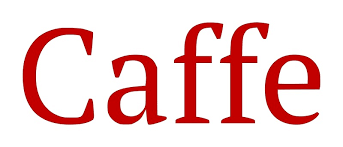

# Caffe Framework for Synopsys EV6x Processors

## Overview

Synopsys-Caffe is a modified version of the popular Caffe Machine Learning
framework adapted for use in embedded applications on Synopsys's DesignWare
EV6x Processors.

## Resources

* [Source Repository](https://github.com/foss-for-synopsys-dwc-arc-processors/synopsys-caffe)
* [Releases Page](https://github.com/foss-for-synopsys-dwc-arc-processors/synopsys-caffe/releases)
* [Documentation](https://github.com/foss-for-synopsys-dwc-arc-processors/synopsys-caffe/blob/master/README.md)
* [Support](https://github.com/foss-for-synopsys-dwc-arc-processors/synopsys-caffe/issues)
