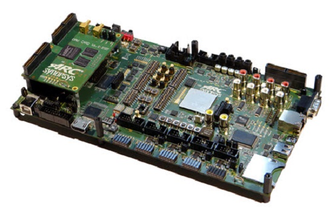

# ARC AXS101 Software Development Platform

## Overview

The ARC AXS101 Software Development Platform, which includes the AXC001 CPU
Card hardware, has an ARC Processor IC with a total of four ARC CPUs that
allow processor operation at the following target speeds:

* ARC 770D33 - 800 MHz
* ARC 625D/AS221BD33 – 600 MHz
* ARC EM4/EM633 – 475 MHz

One of the cores of the AS221BD can boot individually as an ARC 625D. The ARC
EM6 can be used as an ARC EM4 by disabling the caches. The ARC Processor IC
also includes audio peripherals and 128 kByte of on-chip SRAM and the CPU Card
features 512 MByte of DDR2-SDRAM. The deliverables include a software package
containing a pre-built Linux image, U-Boot, pre-built MQX Real-Time Operating
System (RTOS) binaries, bare metal drivers and application examples. Code
development is made easy using the ARC MetaWare Development Toolkit, including
the free MetaWare Lite tools. For Linux development, the ARC GNU tools can
be used to develop software on the ARC 770D processor.

## Useful Links

* [AXS101 Main Board User Guide](files/ARC_AXS101_Mainboard_User_Guide.pdf)
* [AXC001 CPU Card User Guide](files/ARC_AXC001_User_Guide.pdf)
* [embARC Open Software Platform Documentation](https://foss-for-synopsys-dwc-arc-processors.github.io/embarc_osp)
* [embARC Open Software Platform Releases Page](https://github.com/foss-for-synopsys-dwc-arc-processors/embarc_osp/releases)

## How to Order

* [Order ARC AXS101 Software Development Platform](https://www.synopsys.com/cgi-bin/dwarcsdp/req1.cgi)

## Support

* [Ask a question, report a bug or request an enhancement](https://github.com/foss-for-synopsys-dwc-arc-processors/ARC-Development-Systems-Forum/wiki/Reporting-a-bug)
