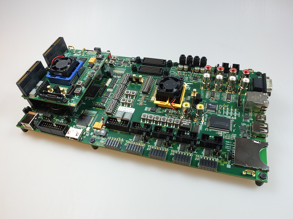
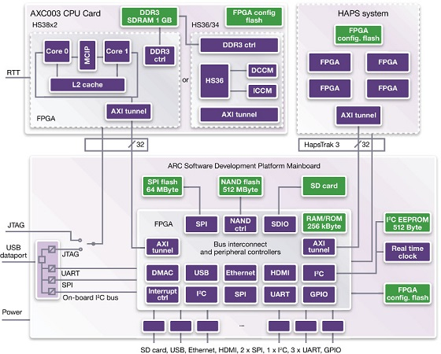

# 🕥 ARC AXS103 Software Development Platform

!!! warning

    AXS board is no longer supported. There is no guarantee that this guide will
    be applicable for the latest tools.

## Overview

The ARC AXS103 Software Development Platform includes the AXC003 CPU Card and
supports the ARC HS34, HS36 and HS38 processors. It allows processor operation
at the following speeds:

* ARC HS34/HS36 - 100 MHz
* ARC HS38x2 (dual core) - 100 MHz

The ARC AXC003 CPU card contains 256 kByte of on-chip SRAM and features
1 GByte of DDR3-SDRAM. The software delivered as part of the ARC AXC003 CPU
Card includes pre-built SMP Linux image (plus the U-boot bootloader) and the
MQX RTOS in binary format. Bare metal and MQX RTOS device driver source code
for a subset of the peripherals and example applications. Code development
is made easy using the MetaWare Development Toolkit, MetaWare Lite tools
or the ARC GNU Tool Chain.

## Block Diagram

## Useful Links

* [AXS103 Main Board User Guide](files/ARC_AXS103_Mainboard_User_Guide.pdf)
* [AXC003 CPU Card User Guide](files/ARC_AXC003_User_Guide.pdf)
* [Release Notes](files/ARC_AXS103_Release_Notes.pdf)
* [Official Synopsys Page](https://www.synopsys.com/dw/ipdir.php?ds=arc-software-development-platform)
* [embARC Open Software Platform Documentation](https://foss-for-synopsys-dwc-arc-processors.github.io/embarc_osp)
* [embARC Open Software Platform Releases Page](https://github.com/foss-for-synopsys-dwc-arc-processors/embarc_osp/releases)

## How to Order

* [Order ARC AXS103 Software Development Platform](https://www.synopsys.com/cgi-bin/dwarcsdp/req1.cgi)

## Support

* [Ask a question, report a bug or request an enhancement](https://github.com/foss-for-synopsys-dwc-arc-processors/ARC-Development-Systems-Forum/wiki/Reporting-a-bug)
