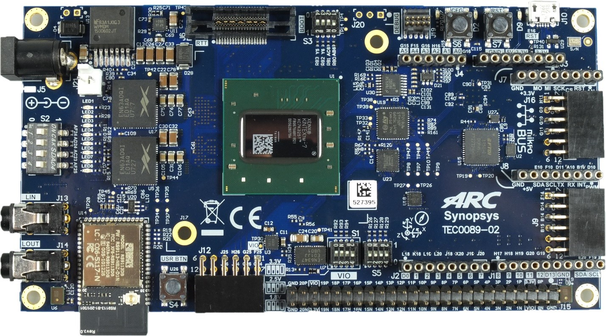
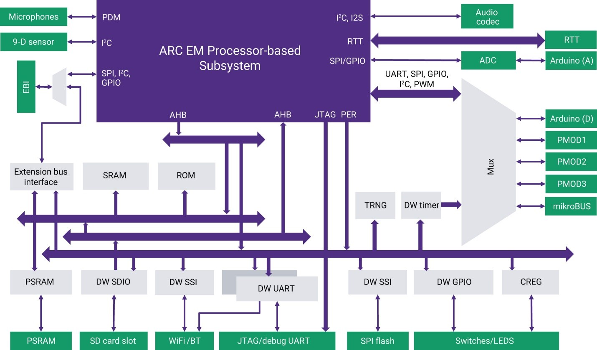

# ARC EM Software Development Platform



## Overview

The DesignWare® ARC® EM Software Development Platform (SDP) is a flexible
platform for rapid software development on ARC EM processors and subsystems.
It is intended to accelerate software development and debug of ARC EM
processor-based systems for a wide range of ultra-low power embedded
applications such as IoT, sensor fusion, and voice applications.

The EM SDP includes an FPGA-based hardware board with commonly used peripherals
and interfaces for extensibility. Downloadable platform packages containing
different hardware configurations enable the board to be programmed with
different ARC EM processors and subsystems. The packages also contain the
necessary software configuration information for the toolchain and embARC Open
Software Platform. The development platform is supported by Synopsys’
ARC MetaWare Development Toolkit, which includes a compiler, debugger and
libraries optimized for maximum performance with minimal code size. The embARC
Open Software Platform (OSP), available online from embARC.org, gives
developers online access to device drivers, FreeRTOS, middleware and examples
that enables them to quickly start software development for their ARC-based
embedded systems.

Key Features

* Xilinx Kintex-7 XC7K325T-2FBG676C
* 32 MByte Quad-SPI Flash memory (for configuration and operation)
* USB-JTAG bridge FT2232H
* FPGA configuration through:
    * JTAG
    * SPI Flash memory
* SPI Flash configuration through:
    * JTAG
    * USB
* Connectors
    * Arduino compatible pin headers
    * MicroBUS compatible pin headers
    * 3x Pmod compatible pin headers
    * 50 pin header 2.54mm (40 single-ended IO, 20 differential lanes, variable VCCIO)
    * Mictor Debug connector
    * 10 pin Debug connector 2mm
* 2 x 8 MByte PSRAM IS66WVC4M16EALL
* 32 MByte User Quad-SPI Flash memory
* Micro SDcard Socket
* Wireless module RS9113-NBZ-D1C (Wi-Fi/BT/BLE)
* 3-axis gyroscope, 3-axis accelerometer, 3-axis magnetometer MPU-9250
* Stereo Audio Codec MAX9880A
* 2 x PDM Microphones SPK0641HT4H-1
* 2 x 3.5mm RCA audio jacks (input/output)
* 100MHz User Clock Oscillator SiT8008
* Status LEDs
* Power LED
* 8 x User LEDs
* Reset Buttons
* User Button
* 2 x 4bit User DIP switches
* 12V Power Supply
* 12V fan

## Block Diagram



## Connecting to the Serial Terminal

!!! warning

    On Linux machines it may be necessary for a user to be in `dialout`
    group to successfully connect to a serial terminal. In case of
    "Permission denied" error try to add a user to the group:

    ```shell
    sudo usermod -aG dialout username
    ```

Connecting to the board using USB data port allows to connect to the serial
terminal over UART. You need to configure these parameters of a serial
terminal to interact with the serial port:

* baud-rate 115200
* 8 data bits
* 1 stop Bit

On Windows [Putty](https://www.putty.org/) or any similar software may be used for connecting
to the serial terminal. You can find the port number in **Device Manager** in
**Ports (COM & LPT)** section: **USB Serial Port (COMx)** where **COMx** is
a value for **Serial line** field in Putty's. Other parameters may be set
**Connection → Serial** menu.

On Linux `minicom` or other similar utilities may be used. Here is an example
of command line for `minicom`:

```shell
minicom -8 -b 115200 -D /dev/ttyUSB1
```

After resetting the EM SDP you will see this output of the bootloader:

```text
U-Boot 2020.04 (Sep 09 2022 - 08:54:58 +0200)

CPU:   ARC EM11D v5.6 at 40 MHz
Subsys:ARC Data Fusion IP Subsystem
Model: snps,emsdp
Board: ARC EM Software Development Platform v1.2
DRAM:  16 MiB
PSRAM initialized.
MMC:   mmc0@f0010000: 0
Loading Environment from FAT... MMC: no card present
In:    serial0@f0004000
Out:   serial0@f0004000
Err:   serial0@f0004000
emsdp#
```

## Building and Running Baremetal Applications

EM SDP board is shipped with with FPGA chip. There is a number of ARC EM images
available for writing to it. Here is a list of those images and corresponding
target options for GCC:

| CPU image | GCC targets options                                               |
|-----------|-------------------------------------------------------------------|
| EM11D     | `-mcpu=em4_fpuda -mmpy-option=6 -mfpu=fpuda_all`                  |
| EM9D      | `-mcpu=em4_fpuda -mmpy-option=6 -mfpu=fpuda_all`                  |
| EM7D      | `-mcpu=em4_dmips -mno-div-rem -mmpy-option=3 -mfpu=fpuda_all`     |
| EM7D ESP  | `-mcpu=em4_fpuda -mmpy-option=6 -mbarrel-shifter -mfpu=fpuda_all` |
| EM6       | `-mcpu=em4_dmips -mno-div-rem -mmpy-option=3 -mfpu=fpuda_all`     |
| EM5D      | `-mcpu=em4_fpuda -mmpy-option=6 -mfpu=fpuda_all`                  |
| EM4       | `-mcpu=em4_fpuda -mno-div-rem -mmpy-option=3 -mfpu=fpuda_all`     |

In this guide we use EM11D core as an example. Also, the version of the EM SDP
firmware is considered to be 1.0 or 1.1.

Consider a simple application with name `main.c`:

```c
#include <stdio.h>

int main()
{
    printf("Hello, World!\n");
    return 0;
}
```

Build the application:

```shell
arc-elf32-gcc -mcpu=em4_fpuda -mmpy-option=6 -mfpu=fpuda_all \
              -specs=emsdp1.1.specs main.c -o main.elf
```

`-specs=emsdp1.1.specs` sets a proper memory map and links the
application with additional startup code and UART library for input/output
operations.

Here is a list of all available `specs` files:

| Specs file           | EM SDP firmware | Description                               |
|----------------------|-----------------|-------------------------------------------|
| `emsdp1.1.specs`     | 1.0, 1.1        | Code and data are placed in ICCM and DCCM |
| `emsdp1.1_ram.specs` | 1.0, 1.1        | Code and data are placed in RAM           |
| `emsdp1.2.specs`[^1] | 1.2             | Code and data are placed in ICCM and DCCM |
| `emsdp1.2_ram.specs` | 1.2             | Code and data are placed in RAM           |

[^1]:
    The memory map for EM SDP 1.2 firmware differs from the memory map for
    EM SDP 1.0 and 1.1. That is why there are different specs files.

Follow [Using OpenOCD](./use-openocd.md) guide and start OpenOCD
with `snps_em_sk_v2.3.cfg` configuration file. Here is a possible output:

```text
$ openocd  -f board/snps_em_sk_v2.3.cfg
Open On-Chip Debugger 0.12.0+dev-gffa52f0e0 (2023-08-02-10:41)
Licensed under GNU GPL v2
For bug reports, read
        http://openocd.org/doc/doxygen/bugs.html
Info : Listening on port 6666 for tcl connections
Info : Listening on port 4444 for telnet connections
Info : ftdi: if you experience problems at higher adapter clocks, try the command "ftdi tdo_sample_edge falling"
Info : clock speed 10000 kHz
Info : JTAG tap: arc-em.cpu tap/device found: 0x200044b1 (mfg: 0x258 (ARC International), part: 0x0004, ver: 0x2)
Info : starting gdb server for arc-em.cpu on 3333
Info : Listening on port 3333 for gdb connections
```

Then connect to the server using GDB:

```text
$ arc-elf32-gdb -quiet main.elf
(gdb) target remote :3333

# Increase timeout, because OpenOCD sometimes can be slow
(gdb) set remotetimeout 15

# Load application into target
(gdb) load

# Go to start of main function
(gdb) tbreak main
(gdb) continue

# Resume with usual GDB commands
(gdb) step
(gdb) next

# Go to end of the application
(gdb) tbreak exit
(gdb) continue

# For example, check exit code of application
(gdb) info reg r0
```

## How to Manually Flash a Firmware

You can flash a firmware of ARC CPU manually using [Digilent Adept utilities](./digilent.md).
Firstly, ensure that EM SDP in connected to the host:

```text
$ djtgcfg enum
Found 1 device(s)

Device: JtagSmt1
    Device Transport Type: 00020001 (USB)
    Product Name:          Digilent JTAG-SMT1
    User Name:             JtagSmt1
    Serial Number:         210203826102
```

Device name for EM SDP is `JtagSmt1`. Then get a firmware from EM SDP bundle
(for example, `emsdp_em11d_dfss.bit` for EM11D), init the board using
`init` command and program board's FPGA:

```text
$ djtgcfg -d JtagSmt1 init
Initializing scan chain...
Found Device ID: 43651093

Found 1 device(s):
    Device 0: XC7K325T

$ djtgcfg -d JtagSmt1 prog -i 0 -f emsdp_em11d_dfss.bit
Programming device. Do not touch your board. This may take a few minutes...
Programming succeeded.
```

## Useful Links

* [ARC EM Software Development Platform - User Guide](files/ARC_EM_SDP_User_Guide.pdf)
* [Official Synopsys Page](https://www.synopsys.com/designware-ip/processor-solutions/arc-em-software-development-platform.html)
* [embARC Open Software Platform Documentation](https://foss-for-synopsys-dwc-arc-processors.github.io/embarc_osp)
* [embARC Open Software Platform Releases Page](https://github.com/foss-for-synopsys-dwc-arc-processors/embarc_osp/releases)

## Support

* [Ask a question, report a bug or request an enhancement](https://github.com/foss-for-synopsys-dwc-arc-processors/ARC-Development-Systems-Forum/wiki/Reporting-a-bug)
