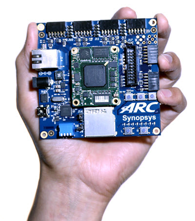

# ARC EM Starter Kit



## Overview

The DesignWare® ARC® EM Starter Kit is a low-cost, versatile solution enabling
rapid software development, software debugging, and profiling for the ARC EM
Family of processors, including the EM4, EM6, EM5D, EM7D, EM9D and EM11D cores.
The ARC EM Starter Kit consists of a hardware platform, including pre-installed
FPGA images of different ARC EM processor configurations with peripherals.
A comprehensive suite of free and open source software is available from the
<https://embARC.org> website for use with the board. Over fifty example
applications are included to help get started quickly with developing software
for ARC EM processors.

The development board is based on a Xilinx Spartan®-6 LX150 FPGA and supports
a variety of hardware extensions via six 2x6 connectors supporting a total of
48 user I/O pins (plus power and ground pins) that can be used to connect
components such as sensors, actuators, memories, displays, buttons, switches,
and communication devices. A Digilent Pmod™ Compatible extension board
containing a 4-channel 12-bit A/D converter with an I2C interface and an AC
power adapter is included in the package.

ARC EM Starter Kit includes the following features:

* Closely Coupled Memory for instructions and for data
* 128 MByte DDR3 RAM
* Six connectors for hardware extensions
* Flexible selection of UART, SPI, I2C and GPIO peripherals
* JTAG and serial console over USB
* Standard 20-pin JTAG connector also supporting 4-wire JTAG for ARC EM processor
* 8 Mbyte for application software available in on-board flash
* SD-card for additional application software and data storage

## Connecting to the Serial Terminal

!!! warning

    On Linux machines it may be necessary for a user to be in `dialout`
    group to successfully connect to a serial terminal. In case of
    "Permission denied" error try to add a user to the group:

    ```shell
    sudo usermod -aG dialout username
    ```

Connecting to the board using USB data port allows to connect to the serial
terminal over UART. You need to configure these parameters of a serial
terminal to interact with the serial port:

* baud-rate 115200
* 8 data bits
* 1 stop Bit

On Windows [Putty](https://www.putty.org/) or any similar software may be used for connecting
to the serial terminal. You can find the port number in **Device Manager** in
**Ports (COM & LPT)** section: **USB Serial Port (COMx)** where **COMx** is
a value for **Serial line** field in Putty's. Other parameters may be set
**Connection → Serial** menu.

On Linux `minicom` or other similar utilities may be used. Here is an example
of command line for `minicom`:

```shell
minicom -8 -b 115200 -D /dev/ttyUSB1
```

After resetting the EMSK 2.2 you will see this output of the bootloader:

```text
***********************************
**       Synopsys, Inc.          **
**     ARC EM Starter kit        **
**                               **
** Comprehensive software stacks **
**   available from embARC.org   **
**                               **
***********************************
Firmware   Jan 11 2016, v2.2
Bootloader Dec 29 2015, v1.1
ARC EM11D, core configuration #3 

ARC IDENTITY = 0x42
RF_BUILD = 0xc902
TIMER_BUILD = 0x10304
ICCM_BUILD = 0x804
DCCM_BUILD = 0x10804
I_CACHE_BUILD = 0x135104
D_CACHE_BUILD = 0x215104

SelfTest PASSED

Info: No boot image found
```

## Useful Links

* [ARC EM Starter Kit - User Guide](files/ARC_EM_Starter_Kit_User_Guide.pdf)
* [embARC Open Software Platform Documentation](https://foss-for-synopsys-dwc-arc-processors.github.io/embarc_osp)
* [embARC Open Software Platform Releases Page](https://github.com/foss-for-synopsys-dwc-arc-processors/embarc_osp/releases)

## Support

* [Ask a question, report a bug or request an enhancement](https://github.com/foss-for-synopsys-dwc-arc-processors/ARC-Development-Systems-Forum/wiki/Reporting-a-bug)
