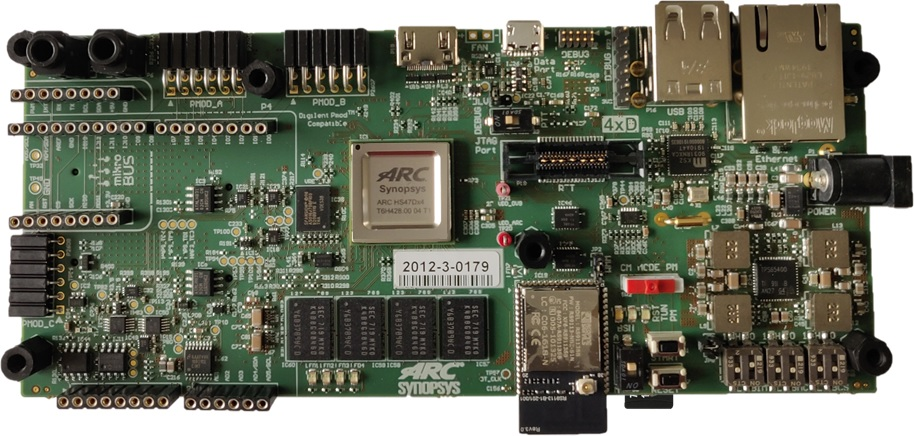

# ARC HS Development Kit 4xD



## Overview

The ARC HS4x/HS4xD Development Kit Platform supports the ARC HS45D, HS47D and
HS48 quad core processors running at 1GHz.

The ARC HS4x/HS4xD Development Kit features 256 kByte of on-chip SRAM and
4 GByte of DDR3-SDRAM. The software available from Synopsys for the ARC
HS4x/HS4xD Development Kit includes pre-built SMP Linux image (plus the U-Boot
bootloader). Code development is made easy using the MetaWare Development
Toolkit, MetaWare Lite tools or the ARC GNU Tool Chain.

## Connecting to the Serial Terminal

!!! warning

    On Linux machines it may be necessary for a user to be in `dialout`
    group to successfully connect to a serial terminal. In case of
    "Permission denied" error try to add a user to the group:

    ```shell
    sudo usermod -aG dialout username
    ```

Connecting to the board using USB data port allows to connect to the serial
terminal over UART. You need to configure these parameters of a serial
terminal to interact with the serial port:

* baud-rate 115200
* 8 data bits
* 1 stop Bit
* No HW/SW flow control

On Windows [Putty](https://www.putty.org/) or any similar software may be used for connecting
to the serial terminal. You can find the port number in **Device Manager** in
**Ports (COM & LPT)** section: **USB Serial Port (COMx)** where **COMx** is
a value for **Serial line** field in Putty's. Other parameters may be set
**Connection → Serial** menu.

On Linux `minicom` or other similar utilities may be used. Here is an example
of command line for `minicom`:

```shell
minicom -8 -b 115200 -D /dev/ttyUSB0 -s
```

Then choose `Serial port setup`, press `F` to disable `Hardware Flow Control`, press `Enter` key
and then choose `Exit` to close the configuration menu.

After resetting HSDK you will see this output of the bootloader:

```text
********************************
**       Synopsys, Inc.       **
**   ARC HS Development Kit   **
********************************
** IC revision: Rev 2.0
** Bootloader verbosity: Normal
** Starting HS Core 1
** HS Core running @ 500 MHz
fptr = 8** HS Core fetching application from SPI flash
** HS Core starting application
<debug_uart> 

U-Boot 2020.01 (Apr 26 2020 - 22:30:20 +0300)

CPU:   ARC HS v4.0 at 500 MHz
Model: snps,hsdk-4xd
Board: Synopsys ARC HS4x/HS4xD Development Kit
DRAM:  1 GiB
Relocation Offset is: 3ef8a000
MMC:   mmc0@f000a000: 0
Loading Environment from FAT... MMC: no card present
In:    serial0@f0005000
Out:   serial0@f0005000
Err:   serial0@f0005000
Clock values are saved to environment
Net:   
Warning: ethernet@f0008000 (eth0) using random MAC address - c2:26:b0:99:98:4a
eth0: ethernet@f0008000
hsdk-4xd# 
```

## Useful Links

* [ARC HS Development Platform 4xD v1.0 - User Guide](files/ARC_HSDK_4xD_User_Guide.pdf)
* [Official Synopsys Page](https://www.synopsys.com/dw/ipdir.php?ds=arc-hs-development-kit)
* [Building and Running Baremetal Applications](../baremetal/hardware/hsdk.md)
* [Building and Running Linux](../linux/hsdk/build.md)
* [U-Boot Command Reference for HSDK](../linux/hsdk/uboot-commands.md)
* [embARC Open Software Platform](https://foss-for-synopsys-dwc-arc-processors.github.io/embarc_osp)
* [embARC Open Software Platform Releases Page](https://github.com/foss-for-synopsys-dwc-arc-processors/embarc_osp/releases)

## Support

* [Ask a question, report a bug or request an enhancement](https://github.com/foss-for-synopsys-dwc-arc-processors/ARC-Development-Systems-Forum/wiki/Reporting-a-bug)
