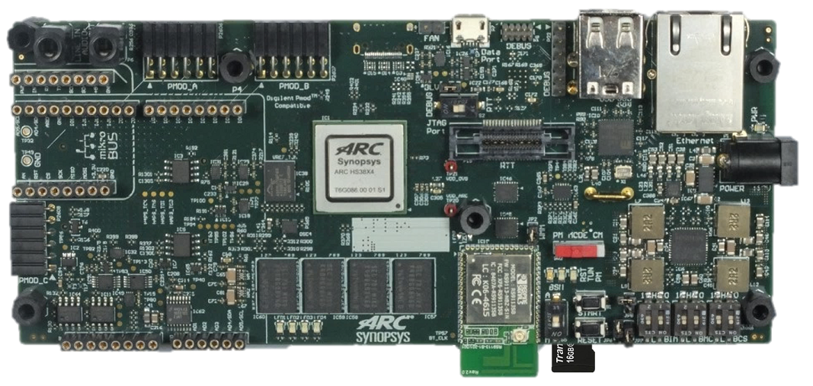

# ARC HS Development Kit

## Overview

The ARC HS Development Kit (HSDK) Platform supports the ARC HS34, HS36 and
HS38x4 quad core processors running at 1GHz.

The ARC HSDK features 256 kByte of on-chip SRAM and 4 GByte of DDR3-SDRAM.
The software available from Synopsys for the ARC HSDK includes pre-built SMP
Linux image (plus the U-Boot bootloader) and the embARC OSP distribution for
embedded systems. embARC OSP source code includes bare metal and FreeRTOS device
drivers and example applications. Code development is made easy using the
MetaWare Development Toolkit, MetaWare Lite tools or the ARC GNU Tool Chain.

## Connecting to the Serial Terminal

Follow the guide for [ARC HS Development Kit 4xD](./board-hsdk-4xd.md).

## Useful Links

* [ARC HS Development Platform v1.0 - User Guide](files/ARC_HSDK_User_Guide.pdf)
* [Official Synopsys Page](https://www.synopsys.com/dw/ipdir.php?ds=arc-hs-development-kit)
* [Building and Running Baremetal Applications](../baremetal/hardware/hsdk.md)
* [Building and Running Linux](../linux/hsdk/build.md)
* [U-Boot Command Reference for HSDK](../linux/hsdk/uboot-commands.md)
* [embARC Open Software Platform Documentation](https://foss-for-synopsys-dwc-arc-processors.github.io/embarc_osp)
* [embARC Open Software Platform Releases Page](https://github.com/foss-for-synopsys-dwc-arc-processors/embarc_osp/releases)

## Support

* [Ask a question, report a bug or request an enhancement](https://github.com/foss-for-synopsys-dwc-arc-processors/ARC-Development-Systems-Forum/wiki/Reporting-a-bug)
