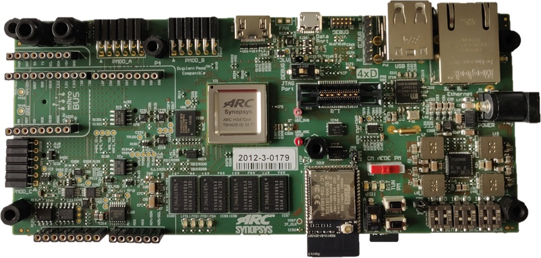
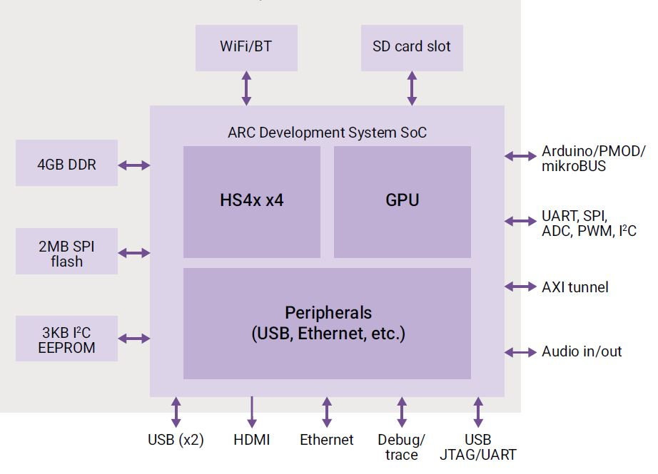
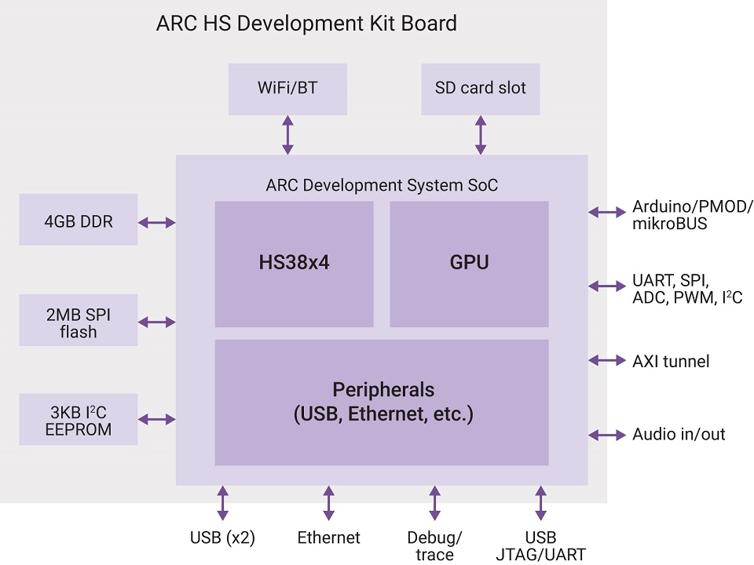

# ARC HS Development Kit



There are two versions of ARC HS Development Kit board:

1. ARC HS Development Kit 4xD with ARC HS4x cores.
2. ARC HS Development Kit with ARC HS3x cores.

## Overview for ARC HS Development Kit 4xD

The ARC HS4x/HS4xD Development Kit Platform supports the ARC HS45D, HS47D and
HS48 quad core processors running at 1GHz.

The ARC HS4x/HS4xD Development Kit features 256 kByte of on-chip SRAM and
4 GByte of DDR3-SDRAM. The software available from Synopsys for the ARC
HS4x/HS4xD Development Kit includes pre-built SMP Linux image (plus the U-Boot
bootloader). Code development is made easy using the MetaWare Development
Toolkit, MetaWare Lite tools or the ARC GNU Tool Chain.



## Overview for ARC HS Development Kit

The ARC HS Development Kit (HSDK) Platform supports the ARC HS34, HS36 and
HS38x4 quad core processors running at 1GHz.

The ARC HSDK features 256 kByte of on-chip SRAM and 4 GByte of DDR3-SDRAM.
The software available from Synopsys for the ARC HSDK includes pre-built SMP
Linux image (plus the U-Boot bootloader) and the embARC OSP distribution for
embedded systems. embARC OSP source code includes bare metal and FreeRTOS device
drivers and example applications. Code development is made easy using the
MetaWare Development Toolkit, MetaWare Lite tools or the ARC GNU Tool Chain.



## Connecting to the Serial Terminal

!!! warning

    On Linux machines it may be necessary for a user to be in `dialout`
    group to successfully connect to a serial terminal. In case of
    "Permission denied" error try to add a user to the group:

    ```shell
    sudo usermod -aG dialout username
    ```

Connecting to the board using USB data port allows to connect to the serial
terminal over UART. You need to configure these parameters of a serial
terminal to interact with the serial port:

* baud-rate 115200
* 8 data bits
* 1 stop Bit
* No HW/SW flow control

On Windows [Putty](https://www.putty.org/) or any similar software may be used for connecting
to the serial terminal. You can find the port number in **Device Manager** in
**Ports (COM & LPT)** section: **USB Serial Port (COMx)** where **COMx** is
a value for **Serial line** field in Putty's. Other parameters may be set
**Connection → Serial** menu.

On Linux `minicom` or other similar utilities may be used. Here is an example
of command line for `minicom`:

```shell
minicom -8 -b 115200 -D /dev/ttyUSB0 -s
```

Then choose `Serial port setup`, press `F` to disable `Hardware Flow Control`, press `Enter` key
and then choose `Exit` to close the configuration menu.

After resetting HSDK you will see this output of the bootloader:

```text
********************************
**       Synopsys, Inc.       **
**   ARC HS Development Kit   **
********************************
** IC revision: Rev 2.0
** Bootloader verbosity: Normal
** Starting HS Core 1
** HS Core running @ 500 MHz
fptr = 8** HS Core fetching application from SPI flash
** HS Core starting application
<debug_uart> 

U-Boot 2020.01 (Apr 26 2020 - 22:30:20 +0300)

CPU:   ARC HS v4.0 at 500 MHz
Model: snps,hsdk-4xd
Board: Synopsys ARC HS4x/HS4xD Development Kit
DRAM:  1 GiB
Relocation Offset is: 3ef8a000
MMC:   mmc0@f000a000: 0
Loading Environment from FAT... MMC: no card present
In:    serial0@f0005000
Out:   serial0@f0005000
Err:   serial0@f0005000
Clock values are saved to environment
Net:   
Warning: ethernet@f0008000 (eth0) using random MAC address - c2:26:b0:99:98:4a
eth0: ethernet@f0008000
hsdk-4xd# 
```

## Building and Running Baremetal Applications

Consider a simple application with name `main.c`:

```c
#include <stdio.h>

int main()
{
    printf("Hello, World!\n");
    return 0;
}
```

Build the application:

```shell
arc-elf32-gcc -mcpu=hs38_linux -specs=hsdk.specs main.c -o main.elf
```

`-specs=hsdk.specs` sets a proper memory map and links the
application with additional startup code and UART library for input/output
operations.

Follow [Using OpenOCD](./use-openocd.md) guide and start OpenOCD
with `snps_hsdk.cfg` (for HSDK) or `snps_hsdk_4xd.cfg` (for HSDK 4xD)
configuration file. Here is a possible output for HSDK 4xD:

```text
$ openocd -f board/snps_hsdk_4xd.cfg
Open On-Chip Debugger 0.12.0+dev-gffa52f0e0 (2023-08-02-10:41)
Licensed under GNU GPL v2
For bug reports, read
    http://openocd.org/doc/doxygen/bugs.html
Info : target has l2 cache enabled is enabled
Info : target has l2 cache enabled is enabled
Info : target has l2 cache enabled is enabled
Info : target has l2 cache enabled is enabled
32768
Info : Listening on port 6666 for tcl connections
Info : Listening on port 4444 for telnet connections
Info : ftdi: if you experience problems at higher adapter clocks, try the command "ftdi tdo_sample_edge falling"
Info : clock speed 10000 kHz
Info : JTAG tap: arc-em.cpu4 tap/device found: 0x100c54b1 (mfg: 0x258 (ARC International), part: 0x00c5, ver: 0x1)
Info : JTAG tap: arc-em.cpu3 tap/device found: 0x100854b1 (mfg: 0x258 (ARC International), part: 0x0085, ver: 0x1)
Info : JTAG tap: arc-em.cpu2 tap/device found: 0x100454b1 (mfg: 0x258 (ARC International), part: 0x0045, ver: 0x1)
Info : JTAG tap: arc-em.cpu1 tap/device found: 0x100054b1 (mfg: 0x258 (ARC International), part: 0x0005, ver: 0x1)
Info : starting gdb server for arc-em.cpu4 on 3333
Info : Listening on port 3333 for gdb connections
Info : starting gdb server for arc-em.cpu3 on 3334
Info : Listening on port 3334 for gdb connections
Info : starting gdb server for arc-em.cpu2 on 3335
Info : Listening on port 3335 for gdb connections
Info : starting gdb server for arc-em.cpu1 on 3336
Info : Listening on port 3336 for gdb connections
```

Then connect to the server using GDB (3336 port is used below in
GDB session, because cores are numbered in reverse order and 3336 port
corresponds to the first core):

```text
$ arc-elf32-gdb -quiet main.elf
(gdb) target remote :3336

# Increase timeout, because OpenOCD sometimes can be slow
(gdb) set remotetimeout 15

# Load application into target
(gdb) load

# Go to start of main function
(gdb) tbreak main
(gdb) continue

# Resume with usual GDB commands
(gdb) step
(gdb) next

# Go to end of the application
(gdb) tbreak exit
(gdb) continue

# For example, check exit code of application
(gdb) info reg r0
```

## Useful Links

* [ARC HS Development Platform 4xD v1.0 - User Guide](files/ARC_HSDK_4xD_User_Guide.pdf)
* [ARC HS Development Platform v1.0 - User Guide](files/ARC_HSDK_User_Guide.pdf)
* [Official Synopsys Page](https://www.synopsys.com/dw/ipdir.php?ds=arc-hs-development-kit)
* [embARC Open Software Platform](https://foss-for-synopsys-dwc-arc-processors.github.io/embarc_osp)
* [embARC Open Software Platform Releases Page](https://github.com/foss-for-synopsys-dwc-arc-processors/embarc_osp/releases)

## Support

* [Ask a question, report a bug or request an enhancement](https://github.com/foss-for-synopsys-dwc-arc-processors/ARC-Development-Systems-Forum/wiki/Reporting-a-bug)
