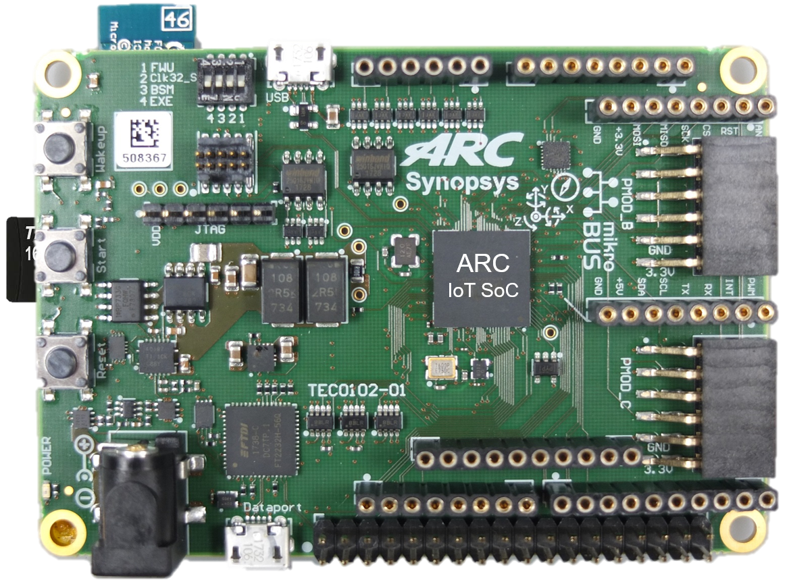

# ARC IoT Development Kit

## Overview

The DesignWare® ARC® IoT Development Kit includes a silicon implementation of
the ARC EM9D-based ARC Data Fusion IP Subsystem running at 144 MHz on SMIC’s
55-nm, ultra-low power process. The SoC also integrates a wide range of common
peripheral interfaces, on-board Bluetooth low-energy module for wireless
connectivity and a 9-axis (gyro, accelerometer and compass) sensor for
wearables and other IoT applications.

The ARC IoT Development Kit is further extensible through available Arduino,
mikroBus and Pmod connectors. The ARC IoT Development Kit includes the
following features:

* ARC IoT SoC
    * 144 MHz EM9D Processor based Data Fusion Subsystem
    * 256KB Closely Coupled Memory for instructions
    * 128KB Closely Coupled Memory for data
    * 32KB X-Memory
    * 32KB Y-Memory
* Rich set of peripherals including USB 2.0 OTG, SDIO (x2), SPI, I2C, UART, I3C, RTC,ADC and PWM
* Memory and Storage
    * 128KB SRAM
    * 256KB eFLASH
    * 2MB SPI Flash (x2)
* Interfaces and Modules
    * USB2.0 OTG port
    * USB Data port (JTAG/UART)
    * Micro-SD Card
    * 9D Sensor
    * Bluetooth Low-Energy module
    * ADC (16 channels)
    * JTAG
    * Power Management IC

## Useful Links

* [ARC IoT Development Kit - User Guide](files/ARC_IoTDK_User_Guide.pdf)
* [Official Synopsys Page](https://www.synopsys.com/dw/ipdir.php?ds=arc_iot_development_kit)
* [embARC Open Software Platform Documentation](https://foss-for-synopsys-dwc-arc-processors.github.io/embarc_osp)
* [embARC Open Software Platform Releases Page](https://github.com/foss-for-synopsys-dwc-arc-processors/embarc_osp/releases)

## Support

* [Ask a question, report a bug or request an enhancement](https://github.com/foss-for-synopsys-dwc-arc-processors/ARC-Development-Systems-Forum/wiki/Reporting-a-bug)
