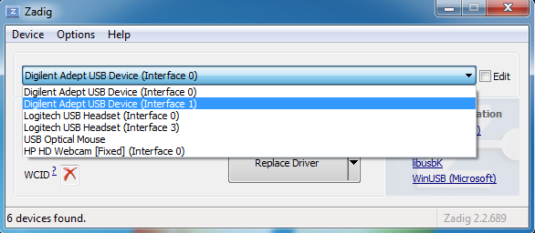
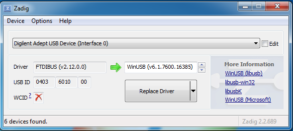

# Installing WinUSB on Windows

!!! warning

    After replacing an original FTDI driver by WinUSB, you cannot use
    MetaWare Debugger or Digilent Adept utilities with ARC devices.

## Replacing FTDI Driver

Before you can start using OpenOCD on Windows, you have to download
WinUSB driver and replace with it one of FTDI drivers for your hardware
development system. To do that, download [Zadig](http://zadig.akeo.ie/)
and run it. You should be able to see Digilent Adept USB Device in the
list of devices.

If your device is not shown by Zadig, then click on **List all devices**
in **Options**.

For EM Starter Kit, select **Digilent Adept USB Device (Interface 0)**,
choose WinUSB driver and press Replace Driver. Your FTDI driver will
be replaced with WinUSB.

For HS Development Kit, IoT Development Kit, EM SDP and AXS10x SDP,
the only thing that differs is that you should select
**Digilent Adept USB Device (Interface 1)**.

Note that antivirus might complain about drivers files created by Zadig.

## Restoring an Original Driver

If you want to change driver for your device back for some reason, you can
uninstall current driver in “Devices and Printers” and then reconnect your
board to the computer, Windows will install the default driver automatically.
